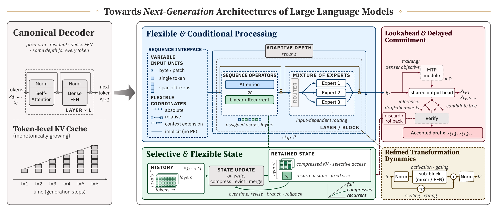
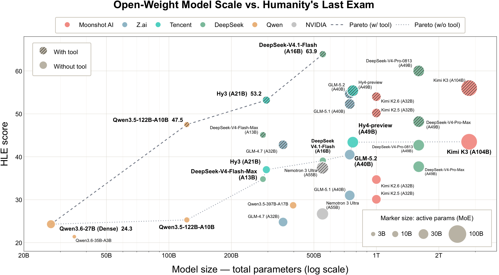

<div align="center">

# Towards Next-Generation Architectures of Large Language Models

**What the canonical decoder fixes, and what recent architectures change.**

A reading guide to the survey: one question, one map, and the design space behind open-weight language models.

[](#survey-map)
[](#chapters)
[](#patterns)

<br>

[🎯 The question](#the-question) · [🖼️ Teaser](#architecture-teaser) · [📈 HLE](#hle) · [🗺️ Survey map](#survey-map) · [📖 Chapters](#chapters) · [🧩 Design space](#design-space) · [🏗️ Patterns](#patterns) · [📚 Literature](README_detailed.md) · [📎 Citation](#citation)

</div>

---

<a id="architecture-teaser"></a>

<p align="center">
  
</p>

<p align="center">
  <sub>
    <b>Opening view of the survey.</b>
    The canonical decoder fixes a pre-norm residual block, a dense feed-forward network, the same depth for every token, and a token-level key–value cache that grows with generation.
    The four panels are the directions developed in <b>Section 15, Beyond Components: A Unified View of Architectural Design</b>.
  </sub>
</p>

<table>
<tr>
<td width="25%" valign="top"><b>⚡ Processing</b><br><sub>Flexible and conditional: who runs, and how much work a token receives.</sub></td>
<td width="25%" valign="top"><b>🧠 State</b><br><sub>Selective and flexible: what history is kept, and how that state is updated.</sub></td>
<td width="25%" valign="top"><b>🔭 Lookahead</b><br><sub>Delayed commitment: predict further ahead, then decide what to keep.</sub></td>
<td width="25%" valign="top"><b>✨ Dynamics</b><br><sub>Refined transforms: the nonlinearity and the path across depth.</sub></td>
</tr>
</table>

---

<a id="the-question"></a>

## 🎯 The question

Large language models have improved through scale, data, and training recipes. Their architectures have changed with them. Most deployed systems are still variations of the decoder-only Transformer in **Section 4, Basic Modules in Transformer**: multi-head self-attention, a position-wise feed-forward network, positional encoding, residual connections, and normalization, with tokenization as the interface to raw text.

**Section 1, Introduction** states the constraint that organizes the rest of the survey. Self-attention is quadratic in sequence length, and the key–value cache grows linearly with context. Dense activation, a fixed layer schedule, and one-token-at-a-time decoding add further training and serving cost. The survey asks how an architecture trades representational power, optimization stability, and computational cost when it relaxes one of those choices and keeps the others.

It differs from a component survey in three ways, all set out in Section 1:

1. It covers the full decoder, from tokenization and position through attention, feed-forward layers, normalization, residuals, the output objective, and depth allocation.
2. **Section 14, Popular Architectures** records how open-weight families actually combine those pieces.
3. **Section 15** rereads the same mechanisms as assumptions of the canonical decoder that each design preserves, refines, or relaxes.

<a id="hle"></a>

## 📈 Where open-weight models stand

Section 1 closes with two snapshots. MMLU against release date covers roughly 2021–2025 and is reproduced in the [literature map](README_detailed.md#mmlu). By 2026 that benchmark was nearing saturation, so the survey turns to Humanity’s Last Exam for the recent open-weight generation.

<p align="center">
  
</p>

<p align="center">
  <sub>
    <b>Humanity’s Last Exam versus open-weight model size</b> (Section 1).
    The plot is concentrated on models released in 2026; GLM-4.7, from late 2025, is kept as a reference.
    The horizontal axis is total parameters on a log scale.
    Marker area grows with active parameters for mixture-of-experts models and with total parameters for dense models.
    Dashed and dotted curves are the observed Pareto frontiers with and without tools. Both start from Qwen3.6-27B (Dense); that model’s tool-use protocol is unspecified.
    Scores that mix tool-enabled and non-tool protocols should be compared with caution.
  </sub>
</p>

Four earlier trends, read off the MMLU snapshot in Section 1, still frame this picture.

| Trend | What Section 1 reports |
|---|---|
| Scale | At a given moment, larger models tend to score higher than smaller contemporaries. |
| Recipe, not only size | Newer and smaller models often pass older and much larger ones, consistent with compute-optimal, data-rich training. |
| Sparse capacity | Mixture-of-experts designs reach the top of the range at high sparsity, with a lower active-parameter cost. |
| Open versus proprietary | Proprietary systems have defined the upper envelope. On HLE the gap remains, and tool use moves the strongest open-weight scores by well over ten points. |

Nearly all of the models on the HLE figure are sparse mixture-of-experts models, and scores still rise with total parameter count along the observed frontiers.

---

<a id="survey-map"></a>

## 🗺️ Survey map

**Section 2, Overview** is the roadmap. Sections 1 and 2 frame the tree; they are not a third technical family. The nodes below are the taxonomy in Section 2, numbered as in the survey. Color follows the role of each block in the stack.

```mermaid
flowchart LR
    ROOT(["Towards next-generation<br/>LLM architectures"])

    ROOT --> FND
    ROOT --> ATT
    ROOT --> LIN
    ROOT --> MOE
    ROOT --> BLK
    ROOT --> IFC
    ROOT --> CMP
    ROOT --> SYN

    subgraph FND["Foundations"]
        direction LR
        H3["3 · History of<br/>Language Modeling Architectures"]
        H4["4 · Basic Modules<br/>in Transformer"]
        H3 --> H4
    end

    subgraph ATT["Efficient attention and KV cache"]
        direction LR
        A5["5 · Efficient Attention<br/>and KV Cache Management"]
        A5 --> A51["5.1 Token"]
        A5 --> A52["5.2 Head"]
        A5 --> A53["5.3 Dimension"]
        A5 --> A54["5.4 Layer"]
    end

    subgraph LIN["Linear sequence operators"]
        direction LR
        L6["6 · Linear<br/>Language Models"]
        L6 --> L61["6.1 RNN"]
        L6 --> L62["6.2 Fast weights"]
        L6 --> L63["6.3 State space"]
        L6 --> L64["6.4 Linearized<br/>attention"]
        L6 --> L65["6.5 Unification"]
    end

    subgraph MOE["Conditional capacity"]
        direction LR
        M7["7 · Mixture of Experts"]
        M7 --> M71["7.1 Evolution of<br/>MoE in LLMs"]
        M71 --> M71a["Sparse gating"]
        M71 --> M71b["Fine-grained<br/>shared experts"]
        M71 --> M71c["Systems-oriented<br/>variants"]
    end

    subgraph BLK["Intra-block transforms"]
        direction LR
        B8["8 · Activation<br/>Functions"]
        B9["9 · Normalization and<br/>Residual Connections"]
    end

    subgraph IFC["Input interface"]
        direction LR
        I10["10 · Positional<br/>Encoding"]
        I11["11 · Tokenization"]
        I10 --> I101["10.1 Absolute"]
        I10 --> I102["10.2 Relative"]
        I10 --> I103["10.3 Context<br/>extension"]
        I11 --> I111["11.1 Granularity"]
        I11 --> I112["11.2 Vocabulary<br/>size"]
    end

    subgraph CMP["Compute per generated token"]
        direction LR
        C12["12 · Multi-Token<br/>Prediction"]
        C13["13 · Adaptive and<br/>Recurrent Depth"]
        C12 --> C121["12.1 Parallel"]
        C12 --> C122["12.2 Sequential"]
        C12 --> C123["12.3 Draft-then-verify"]
        C13 --> C131["13.1 Early exit"]
        C13 --> C132["13.2 Conditional<br/>depth"]
        C13 --> C133["13.3 Looped depth"]
    end

    subgraph SYN["System-level synthesis"]
        direction LR
        S14["14 · Popular<br/>Architectures"]
        S15["15 · Unified View of<br/>Architectural Design"]
        S16["16 · Concluding<br/>Remarks"]
        S14 --> S15 --> S16
    end

    classDef root fill:#111827,color:#F9FAFB,stroke:#111827,font-weight:700;
    classDef fnd fill:#DBEAFE,color:#1E3A8A,stroke:#BFDBFE;
    classDef att fill:#E0F2FE,color:#0C4A6E,stroke:#BAE6FD;
    classDef lin fill:#CCFBF1,color:#134E4A,stroke:#99F6E4;
    classDef moe fill:#EDE9FE,color:#4C1D95,stroke:#DDD6FE;
    classDef blk fill:#FFEDD5,color:#7C2D12,stroke:#FED7AA;
    classDef ifc fill:#DCFCE7,color:#14532D,stroke:#BBF7D0;
    classDef cmp fill:#FFE4E6,color:#881337,stroke:#FECDD3;
    classDef syn fill:#FEF3C7,color:#78350F,stroke:#FDE68A,font-weight:700;

    class ROOT root;
    class H3,H4 fnd;
    class A5,A51,A52,A53,A54 att;
    class L6,L61,L62,L63,L64,L65 lin;
    class M7,M71,M71a,M71b,M71c moe;
    class B8,B9 blk;
    class I10,I11,I101,I102,I103,I111,I112 ifc;
    class C12,C13,C121,C122,C123,C131,C132,C133 cmp;
    class S14,S15,S16 syn;
```



The color legend is the one used by the taxonomy in Section 2.

| Color | Role in the stack | Sections |
|---|---|---|
| 🔵 Blue | History and the Transformer foundation | 3–4 |
| 💠 Light blue | Keep quadratic attention, shrink the KV state | 5 |
| 🌊 Teal | Replace pairwise mixing with a linear-time operator | 6 |
| 🟣 Purple | Conditional parameter activation | 7 |
| 🍑 Peach | Nonlinearity, normalization, and residual paths inside a block | 8–9 |
| 🟢 Green | The units and coordinates of the sequence | 10–11 |
| 🪸 Coral | How much work is spent per generated token | 12–13 |
| 🟡 Cream | How released models combine the above, and what assumption that changes | 14–16 |

Sections 5 and 6 are two answers to the same cost: cheapen mixing over time. Sections 12 and 13 are two answers to another: decide how much computation a generated token receives.

<a id="chapters"></a>

## 📖 Chapters

Reading order is the order of the survey. Each note below is the claim of that chapter, not a second taxonomy.

### 🧭 1–2 · Frame

**Section 1, Introduction** places architecture next to scaling laws. Loss tracks model size, data, and compute fairly smoothly, but the architecture decides complexity, optimization dynamics, and what kind of state the model is allowed to keep. The section also locates modern attention in a longer line: LSTM pretrained models, then the 2017 Transformer, whose attention mechanism the survey traces to the 1991 unnormalized linear Transformer.

**Section 2, Overview** is the reading map drawn above. After the component chapters, the survey turns from layers to generation: how many tokens one forward pass is asked to predict, and how many layers each token actually traverses.

### 🧱 3–4 · Foundations

**Section 3, History of Language Modeling Architectures** starts from language as a stochastic process. Markov’s counts and Shannon’s *n*-gram source are the probabilistic problem. The architectural answers that follow are statistical *n*-grams, recurrent networks, fast-weight programmers, LSTM’s protected additive state, and then self-attention as a way to select over an explicit history instead of compressing it into a fixed state.

**Section 4, Basic Modules in Transformer** fixes the notation every later chapter uses.

| | Module | What it fixes |
|---|---|---|
| 4.1 | Multi-head Attention | Pairwise mixing. In a decoder, causality limits each query to the past. |
| 4.2 | Feed-Forward Network | Position-wise channel mixing, and a large share of the model’s parameters. |
| 4.3 | Positional Encoding | Order. Full attention without a positional signal is permutation-equivariant; the causal mask is another, weaker source of order. |
| 4.4 | Residual Connections and Normalization | The path by which representations and gradients cross depth. |
| 4.5 | Tokenization and Input Embeddings | The discrete interface to raw text. |
| 4.6 | Output Projection and Autoregressive Generation | One next-token distribution, then one committed token. |
| 4.7 | Encoder / decoder layouts | Decoder-only is the LLM default. Encoder-only and encoder–decoder remain the other two configurations. |
| 4.8 | Computational Complexity | Training cost is a forward pass over length *T*. Decoding cost is per new token with a KV cache. For attention, the projection term dominates when *T* is smaller than the hidden width. |

### 💠 5 · Efficient Attention and KV Cache Management

This chapter keeps quadratic attention and reduces the key–value state that is stored or read. The four axes are orthogonal in intent and not freely stackable in practice.

| | Axis | What changes | Representative ideas |
|---|---|---|---|
| 5.1 | Token | Which past positions are kept, merged, or read | Eviction and compression; sparse reads over a retained cache; attention that is sparse by design, including StreamingLLM, SepLLM, MoBA, NSA |
| 5.2 | Head | How many distinct KV heads exist | Multi-query attention, grouped-query attention, and asymmetric or key-driven groupings |
| 5.3 | Dimension | The width of the cached vector | Multi-head latent attention, tensor-product factors, grouped latents, conversion into latent attention, and post-training width compression such as Palu and ThinK |
| 5.4 | Layer | Which layers own a KV state | Cross-layer merge or reuse, including MiniCache, cross-layer attention, YOCO, MLKV, and layer-condensed KV |

**Section 5.5, Future Directions** singles out two open problems. Token reduction is the axis that can depend on the input, because sequence length is not an architectural constant. Combining axes is attractive and constrained: latent attention already shares one state across heads, so it does not sit cleanly on top of grouped-query attention or head-wise budgets.

### 🌊 6 · Linear Language Models

These models do not sparsify the attention matrix. They avoid explicit pairwise interactions, so cost scales linearly with length. **Section 6** treats four families, then one skeleton.

| | Family | State, in one line |
|---|---|---|
| 6.1 | Recurrent Neural Networks | A fixed-size hidden state. LSTM’s constant-error carousel is the early protected additive path. Modern instances include LRU, Griffin’s RG-LRU, RWKV-6, and xLSTM. |
| 6.2 | Fast Weight Programmers | The state is a fast weight, updated by an outer product. ULTRA (1991) is the early case. DeltaNet, Gated DeltaNet, and RWKV-7 are recent ones. The update can be read as one step of online regression at test time. |
| 6.3 | State Space Models | A linear dynamical system. Mamba makes the transition input-dependent. Mamba-2 and Longhorn sit in the same line. |
| 6.4 | Linearized Attention | A kernel replaces the softmax, which turns attention into a recurrent update. Gated random-feature attention, RetNet, gated linear attention, MetaLA, and Rodimus are instances. |
| 6.5 | Unification | The families share a recurrent update. They differ in the gate, in whether the state is expanded, and in whether the update matches a test-time regression step. |

**Section 6.6, Future Directions** puts the limit on the transition. An input-independent transition, or an input-dependent but diagonal one, cannot route information between state channels. Under the survey’s bounded-depth, log-precision assumptions, that places many of these models in TC⁰ and outside NC¹-hard state tracking such as permutation composition. Richer non-diagonal transitions, depth, and hybrids restore some of that power. A practical pattern already at large scale is to interleave linear layers with softmax attention, often near a 3:1 ratio. Training and prefill use chunkwise parallel kernels; decoding uses a fused recurrent update. Sequence recurrence in this chapter is not the depth recurrence in Section 13.

### 🟣 7 · Mixture of Experts

An expert layer is a router plus a bank of networks, usually feed-forward blocks. Only the selected experts run, so cost tracks active experts rather than the size of the bank. **Section 7.1, Evolution of MoE in LLMs** is one subsection with three overlapping developments, not three separate chapters.

| Development inside 7.1 | What changed |
|---|---|
| Sparse gating | Top-*k* token choice, expert-choice routing, auxiliary balance losses, and the systems that made this trainable: GShard, Switch, BASE, ST-MoE, DeepSpeed-MoE. |
| Fine-grained shared experts | Many small experts, plus a shared expert that every token sees. DeepSeekMoE is the template that later open-weight models inherited. |
| Systems-oriented variants | Communication and expert-weight traffic become design variables: shortcut-connected experts, zero-computation experts, latent experts, and post-training compression of expert weights. |

**Section 7.2, Future Directions** leaves three problems open: better routing, where to place experts across depth, and heterogeneous experts. Current training systems assume experts have the same shape.

### 🍑 8–9 · Inside the block

**Section 8, Activation Functions** follows the feed-forward nonlinearity through four stages in **Section 8.1**: rectification (ReLU and its variants); smooth gates (GELU, SiLU, and Swish); gated linear units, with SwiGLU the default after strong empirical results; and scale-driven departures, including squared ReLU in some hybrid Mamba–Transformer families and clamped SwiGLU where unbounded branches threaten numerics. **Section 8.2** expects the next step to be layer- or task-specific, hardware-aware, and not confined to the feed-forward network. Gating has already been tried on attention outputs.

**Section 9, Normalization and Residual Connections** separates the normalizer from the wiring.

| | Topic | Designs |
|---|---|---|
| 9.1 | Normalization methods | BatchNorm, LayerNorm, RMSNorm, QK-Norm, DeepNorm, and lighter variants such as ScaleNorm |
| 9.2 | How the normalizer meets the residual | Post-LN, Pre-LN, Sandwich-LN, norm-after, Mix-LN, HybridNorm, Hyper-Connections, and manifold-constrained hyper-connections |
| 9.3 | Open problems | Adaptive normalization, a tighter account of the stability–expressivity seesaw, and designs that drop LayerNorm entirely |

Pre-RMSNorm is the wiring most current dense decoders share. That fact becomes one of the reference choices in Section 14.

### 🟢 10–11 · The sequence interface

**Section 10, Positional Encoding** supplies order to an operation that would otherwise be permutation-equivariant.

| | Family | Role |
|---|---|---|
| 10.1 | Absolute | Sinusoidal or learned vectors tied to an index. Length extrapolation is the weak point. |
| 10.2 | Relative | Displacement inside the attention score. Rotary position embedding is the form most open-weight decoders use. ALiBi, T5 bias, and content-adaptive schemes are the other branch. |
| 10.3 | Context extension | Keep a trained positional scheme and stretch the usable range. Position interpolation, LongRoPE, YaRN, and CLEX update the model. Self-Extend and related chunked schemes only rewrite positions at inference. |
| 10.4 | Open problems | Content-dependent positions, no explicit positional encoding under a causal mask, hybrids such as interleaving rotary local layers with global layers that have none, and positions for data that are not a single sequence. |

**Section 11, Tokenization** treats the vocabulary as architecture.

| | Topic | Claim |
|---|---|---|
| 11.1 | Granularity | Characters, words, and subwords trade vocabulary size against sequence length. Tokenization-free models read bytes or characters. Byte Latent Transformer groups bytes into learned patches. |
| 11.2 | Vocabulary size | The compute-optimal vocabulary grows with the compute budget, more slowly than the rest of the parameters. Decoupling the input vocabulary from the output vocabulary, and growing the vocabulary during pre-training, are the two concrete levers. |
| 11.3 | Open problems | Vocabulary as a scaling axis, asymmetric input and output vocabularies, and hierarchical latent tokens between raw bytes and a fixed subword inventory. |

### 🪸 12–13 · Compute per generated token

**Section 12, Multi-Token Prediction** changes the objective before it changes the serving stack. Next-token training supervises one future token. Multi-token training supervises a horizon of *K* future tokens, which includes the ordinary next token. The extra predictors can be dropped at inference, leaving a standard model, or kept as a drafter.

The classification is by factorization. Joint pre-training versus a retrofit is a separate choice of when the predictor is attached.

| | Factorization | What is independent |
|---|---|---|
| 12.1 | Parallel prediction | *K* heads read the same backbone state, so the predictions are cheap and conditionally independent. Blockwise decoding, ProphetNet, multi-token prediction heads, and Medusa are in this group. |
| 12.2 | Sequential prediction | Each extra module sees the preceding future token, so the causal chain is kept. DeepSeek-V3’s single extra module is the recipe many later open-weight models adopted. EAGLE drafts at the feature level; EAGLE-3 drops feature regression and fuses several hidden states. FastMTP shares one module across the horizon. |
| 12.3 | Inference integration | Acceptance rules, token trees, adaptive draft length, and drafter–target alignment. Speculative decoding and speculative sampling define an acceptance rule that preserves the target distribution. SpecDec++ adapts the candidate length. |
| 12.4 | Open problems | Horizon as a scaling axis, hybrids that stay causal without a new module per offset, and keeping the drafter aligned after supervised or reinforcement post-training. |

**Section 13, Adaptive and Recurrent Depth** varies how many layers a token executes. If a binary mask says whether token *i* runs layer *ℓ*, effective depth is the sum of that mask. The standard decoder sets every entry to one.

| | Mechanism | Allocation |
|---|---|---|
| 13.1 | Depth reduction and early exit | A token stops at a prefix, or the network drops layers for every token. LayerDrop, Depth-Adaptive Transformer, CALM, and LayerSkip. LayerSkip’s early layers can draft for the full model, which ties this section to Section 12. |
| 13.2 | Conditional depth | A router sends a fixed-capacity subset of tokens through a block. Mixture-of-Depths does this around the block. CoLT5 keeps a light path for every token and a heavy path for a few. |
| 13.3 | Looped Transformers | The same block is applied *R* times. Universal Transformer, Huginn, Ouro, Mixture-of-Recursions, and fixed-point reasoners differ in topology, in who chooses *R*, and in how much weight tying is relaxed. |
| 13.4 | Training variable depth | Intermediate supervision, credit assignment through recurrence, dynamical stability, and whether extra recurrence extrapolates past the training budget. A reported recurrence-equivalence exponent near one half says shared recurrence only partly replaces unique depth. |
| 13.5 | Open problems | Stable training at greater recurrent depth, budget-conditioned inference, joint allocation with experts and multi-token prediction, and evaluation under matched compute. |

Depth recurrence adds compute by revisiting a shared block. It does not summarize the sequence. That job belongs to Section 6.

### 🟡 14–16 · From components to a design space

**Section 14, Popular Architectures** stops listing modules and reads released models. **Section 14.1** tells the history as four shifts: foundations and open replication; convergence on a reusable dense baseline; diversification of capacity and of state; then joint configuration of capacity, state, and prediction. **Section 14.2** names the four patterns in [Patterns](#patterns). The survey’s dense-model table and mixture-of-experts table are the model-by-model record behind those patterns.

**Section 15** is the teaser at the top of this page, written out as assumptions and alternatives. The dimensions are in [Design space](#design-space). **Section 15.3, Interdependencies and Joint Design** is the reason a module list is not enough: operator choice sets the form of history; sparse activation and compressed history spend different budgets inside one serving stack; tokenization sets the unit of both memory and the prediction horizon; residual paths have to stay stable when depth or the sequence operator changes; a longer draft creates state that may be discarded.

**Section 16, Concluding Remarks** draws three conclusions.

1. The canonical dense decoder, with a fixed schedule and the usual Pre-RMSNorm, SwiGLU, and rotary positions, is still the reference. Most of the survey relaxes one assumption and keeps the rest.
2. The valuable comparisons are joint configurations. Sparse capacity with compressed attention state, hybrid sequence and state processing, and prediction-augmented backbones show up because their pieces interact.
3. The usable design space is bounded by load balance, kernels, credit assignment, and caching. At least one hybrid family returned to full attention when the infrastructure was immature, and later moved to block-sparse attention. Those decisions get revisited.

The open measurement problems Section 16 names are scaling laws for prediction horizon, recurrent depth, and state size under matched training and inference compute; stable optimization of conditional and recurrent computation; and evaluations that report expressivity, efficiency, and stability separately.

---

<a id="design-space"></a>

## 🧩 Design space

**Section 15.1** states the canonical computational structure. Every token uses a fixed tokenization and the same dense blocks. History is an append-only, token-level key–value cache. Each state is trained to predict the next token, and that token is committed before a longer continuation is compared.

**Section 15.2** decomposes the four directions in the teaser into ten design dimensions.

| Direction | Dimension | Canonical assumption | Alternative | Where it is developed |
|---|---|---|---|---|
| Flexible and conditional processing | Sequence interface | One fixed tokenization and positional scheme | Finer, multi-scale, or adaptive units; other positional structure | Sections 10 and 11 |
| | Operator assignment | The same sequence mixer in every layer | Different operators across layers or heads | Sections 5, 6, and 14 |
| | Parameter activation | Every token runs the same dense blocks | Input-dependent routing among experts | Section 7 |
| | Computation allocation | A fixed path and a predetermined amount of work | Early exit, conditional depth, recurrent depth, or a drafter–verifier split | Sections 12 and 13 |
| Refined transformation dynamics | Local nonlinearity | A fixed feed-forward nonlinearity, often SwiGLU | Other gates, such as squared ReLU or clamped SwiGLU | Section 8 |
| | Depth propagation | Fixed residual and normalization pathways | Other placement, residual scaling, or gating | Section 9 |
| Selective and flexible state | History representation | Individually addressable token states | Selective, compressed, recurrent, or hybrid history | Sections 5 and 6 |
| | State update | Append-only growth | Eviction, merging, compression, branching, or rollback | Sections 5, 6, and 12 |
| Lookahead and delayed commitment | Prediction horizon | Next-token supervision only | Multi-step, blockwise, or feature-level prediction | Section 12 |
| | Output commitment | One committed token per forward pass | Drafting, parallel verification, delayed commitment | Section 12 |

A single mechanism can move more than one row. Mixture-of-experts changes parameter activation. Speculative decoding changes output commitment and, while candidates are alive, state update. The teaser draws the rows as four panels because that is how the survey asks the question, not because a model may enter only one panel.

<a id="patterns"></a>

## 🏗️ Patterns in released models

**Section 14.2, Recurring Architectural Design Patterns** defines a pattern as a combination. The four are not a partition. One backbone can instantiate more than one.

<table>
<tr>
<td width="50%" valign="top">

### 📐 14.2.1 · Canonical dense decoders

Decoder-only stack, dense feed-forward blocks, fixed depth. Pre-RMSNorm, SwiGLU, and rotary positions became the usual way to fill that skeleton. LLaMA is the reference instance. Later dense families change the number of key–value heads or the attention span, as Mistral does with grouped-query attention and a sliding window, without leaving the dense path.

</td>
<td width="50%" valign="top">

### 🎛️ 14.2.2 · Sparse capacity, compressed attention state

Expert routing and cache compression spend different budgets. DeepSeek-V2 and DeepSeek-V3 pair fine-grained experts and a shared expert with multi-head latent attention. Other releases pair the same expert layout with grouped-query attention, or with alternating local and global attention. Co-occurrence is not evidence that either piece improves the modeling quality of the other.

</td>
</tr>
<tr>
<td width="50%" valign="top">

### 🔀 14.2.3 · Hybrid sequence and state processing

Softmax attention keeps an addressable history. A recurrent or linear operator compresses history as it is built. Griffin, Jamba, Nemotron, Qwen3-Next, and Kimi Linear interleave the two across layers. Hymba runs them inside a layer. LoLCATs converts a pretrained attention model after the fact. How much softmax attention remains decides how much of the cache is actually gone.

</td>
<td width="50%" valign="top">

### 🔭 14.2.4 · Prediction-augmented backbones

A multi-token objective or module sits on top of a dense, sparse, or hybrid trunk. DeepSeek-V3, MiMo-7B, LongCat-Flash, and MiMo-V2-Flash are instances. The module changes which future tokens supervise the representation. It does not, by itself, decide how a draft is verified or committed. That decision is Section 12.3.

</td>
</tr>
</table>

---

## 🚀 Entry points

A longer, section-numbered literature map is in [README_detailed.md](README_detailed.md). The rows below are the shortest path through the survey.

| If you are reading | Start with |
|---|---|
| Section 3–4 | Shannon’s mathematical theory of communication; LSTM; *Attention Is All You Need*; Kaplan et al. and Hoffmann et al. on scaling |
| Section 5 | Multi-query attention; grouped-query attention; H₂O; StreamingLLM; SepLLM; DeepSeek-V2 / multi-head latent attention; MiniCache |
| Section 6 | *Transformers are RNNs*; *Linear Transformers Are Secretly Fast Weight Programmers*; S4; Mamba; Mamba-2; Gated DeltaNet; test-time regression |
| Section 7 | Adaptive mixtures of local experts; sparsely gated MoE; Switch Transformer; Expert Choice; DeepSeekMoE |
| Section 8–9 | GELU; GLU variants / SwiGLU; LayerNorm; RMSNorm; Pre-LN analysis; Hyper-Connections |
| Section 10–11 | RoPE; ALiBi; position interpolation; YaRN; SentencePiece; ByT5; scaling laws with vocabulary |
| Section 12–13 | Speculative decoding; Medusa; EAGLE; DeepSeek-V3; Mixture-of-Depths; Universal Transformers; Huginn |
| Section 14 | LLaMA; Mistral 7B; Mixtral; Jamba; Qwen3-Next |

---

<a id="citation"></a>

## 📎 Citation

```bibtex
@article{teng2026nextgenllmarchitectures,
  title   = {Towards Next-Generation Architectures of Large Language Models: A Survey},
  author  = {Teng, Yao and Chen, Guoxuan and Chen, Yimeng and Shi, Han
             and Pi{\k{e}}kos, Piotr and Ran, Jie and Zeng, Yutao and Zheng, Chuanyang
             and Li, Jingyao and Li, Nanbo and Bai, Haoli and Huang, Chao
             and Liu, Xihui and He, Di and Liu, Weiyang and Schmidhuber, J{\"u}rgen},
  year    = {2026},
  note    = {Manuscript}
}
```

## 👥 Authors

<p align="center">
  Yao Teng<sup>1,*</sup> ·
  Guoxuan Chen<sup>1,*</sup> ·
  Yimeng Chen<sup>2,†</sup> ·
  Han Shi<sup>3,†</sup> ·
  Piotr Piękos<sup>2</sup> ·
  Jie Ran<sup>3</sup> ·
  Yutao Zeng<sup>4</sup> ·
  Chuanyang Zheng<sup>3</sup> ·
  Jingyao Li<sup>5</sup> ·
  Nanbo Li<sup>2</sup><br>
  Haoli Bai<sup>3</sup> ·
  Chao Huang<sup>1</sup> ·
  Xihui Liu<sup>1</sup> ·
  Di He<sup>6</sup> ·
  Weiyang Liu<sup>5,7</sup> ·
  Jürgen Schmidhuber<sup>2,8</sup>
</p>

<p align="center">
  <sup>1</sup>The University of Hong Kong
  &nbsp;·&nbsp;
  <sup>2</sup>Center of Excellence for Generative AI, KAUST
  &nbsp;·&nbsp;
  <sup>3</sup>Huawei Technologies
  &nbsp;·&nbsp;
  <sup>4</sup>ByteDance Seed<br>
  <sup>5</sup>The Chinese University of Hong Kong
  &nbsp;·&nbsp;
  <sup>6</sup>Peking University
  &nbsp;·&nbsp;
  <sup>7</sup>Max Planck Institute for Intelligent Systems
  &nbsp;·&nbsp;
  <sup>8</sup>The Swiss AI Lab, IDSIA-USI/SUPSI
</p>

<p align="center"><sub>* Equal contribution. &nbsp;&nbsp; † Corresponding authors.</sub></p>

---

<div align="center">
  <sub>
    Companion to <i>Towards Next-Generation Architectures of Large Language Models: A Survey</i>.
    Section-by-section reading lists are in <a href="README_detailed.md">the literature map</a>.
  </sub>
</div>
