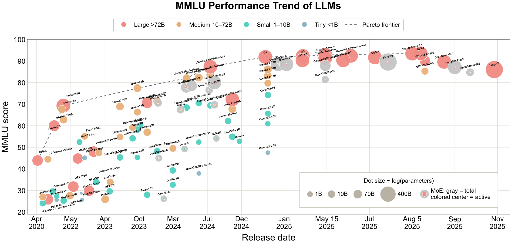

# Literature map

**Section-by-section reading lists for *Towards Next-Generation Architectures of Large Language Models: A Survey***

 

The argument, the architecture teaser, and the HLE snapshot are in the [survey overview](README.md).
This page lists the works each chapter discusses.

---

## Earlier generations, on MMLU

Section 1 uses MMLU to cover models released from about 2021 through 2025, before that benchmark crowded the top of the scale. The horizontal axis is release date. Marker area is a stand-in for parameter count; for older closed models whose sizes were not disclosed, the area is only illustrative. For mixture-of-experts models the outer marker is total parameters and the inner marker is active parameters.

  

  
    <b>MMLU versus release date and parameter count</b> (Section 1).
    Larger markers tend to sit higher than smaller contemporaries.
    Later and smaller models often pass earlier and larger ones.
    Mixture-of-experts models reach the top of the range, and proprietary systems have defined the upper envelope.
    The recent open-weight comparison, on Humanity’s Last Exam, is in the <a href="README.md#hle">survey overview</a>.
  

---

## Contents

The numbers are the survey’s section numbers. Section 2, Overview, is the taxonomy drawn in the [survey map](README.md#survey-map); it does not have a separate reading list.

| | Chapter | In this page |
|---|---|---|
| 1 | Introduction | [below](#1-introduction) |
| 3 | History of Language Modeling Architectures | [below](#3-history-of-language-modeling-architectures) |
| 4 | Basic Modules in Transformer | [below](#4-basic-modules-in-transformer) |
| 5 | Efficient Attention and KV Cache Management | [below](#5-efficient-attention-and-kv-cache-management) |
| 6 | Linear Language Models | [below](#6-linear-language-models) |
| 7 | Mixture of Experts | [below](#7-mixture-of-experts) |
| 8 | Activation Functions | [below](#8-activation-functions) |
| 9 | Normalization and Residual Connections | [below](#9-normalization-and-residual-connections) |
| 10 | Positional Encoding | [below](#10-positional-encoding) |
| 11 | Tokenization | [below](#11-tokenization) |
| 12 | Multi-Token Prediction | [below](#12-multi-token-prediction) |
| 13 | Adaptive and Recurrent Depth | [below](#13-adaptive-and-recurrent-depth) |
| 14 | Popular Architectures | [below](#14-popular-architectures) |
| 15 | Beyond Components: A Unified View of Architectural Design | [below](#15-beyond-components-a-unified-view-of-architectural-design) |
| 16 | Concluding Remarks | [below](#16-concluding-remarks) |
| | Works without a stable public record | [appendix](#appendix--works-without-a-stable-public-record) |

---

## 1. Introduction

Works cited while Section 1 sets the problem: scaling, the cost of attention and the KV cache, and why a component list is not yet an architecture.

View papers

| 📅 Year | 📝 Title | 🏛️ Venue | 📄 Paper |
|------:|--------|--------|--------|
| 1969 | Visual Feature Extraction by a Multilayered Network of Analog Threshold Elements | IEEE Trans. Syst. Sci. Cybern. | [paper](https://doi.org/10.1109/TSSC.1969.300225) |
| 1989 | Connectionist Architectures for Multi-Speaker Phoneme Recognition | NIPS | [paper](http://papers.nips.cc/paper/213-connectionist-architectures-for-multi-speaker-phoneme-recognition) |
| 1991 | Adaptive Mixtures of Local Experts | Neural Comput. | [paper](https://doi.org/10.1162/neco.1991.3.1.79) |
| 1992 | Learning to Control Fast-Weight Memories: An Alternative to Dynamic Recurrent Networks | Neural Comput. | [paper](https://doi.org/10.1162/neco.1992.4.1.131) |
| 1992 | Learning Complex, Extended Sequences Using the Principle of History Compression | Neural Comput. | [paper](https://doi.org/10.1162/neco.1992.4.2.234) |
| 1994 | Hierarchical Mixtures of Experts and the EM Algorithm | Neural Comput. | [paper](https://doi.org/10.1162/neco.1994.6.2.181) |
| 1996 | LSTM can Solve Hard Long Time Lag Problems | NIPS | [paper](http://papers.nips.cc/paper/1215-lstm-can-solve-hard-long-time-lag-problems) |
| 1997 | Long Short-Term Memory | Neural Comput. | [paper](http://arxiv.org/abs/2405.04517v2) |
| 2000 | Learning to Forget: Continual Prediction with LSTM | Neural Comput. | [paper](https://doi.org/10.1162/089976600300015015) |
| 2015 | Highway Networks | arXiv | [paper](http://arxiv.org/abs/1505.00387v2) |
| 2015 | Training Very Deep Networks | NIPS | [paper](http://arxiv.org/abs/1507.06228v2) |
| 2015 | Batch Normalization: Accelerating Deep Network Training by Reducing Internal Covariate Shift | arXiv | [paper](http://arxiv.org/abs/1502.03167v3) |
| 2016 | Deep Residual Learning for Image Recognition | CVPR | [paper](http://arxiv.org/abs/1512.03385v1) |
| 2016 | Gaussian Error Linear Units (GELUs) | arXiv | [paper](http://arxiv.org/abs/1606.08415v5) |
| 2016 | Layer Normalization | arXiv | [paper](http://arxiv.org/abs/1607.06450v1) |
| 2017 | Attention is All you Need | NIPS | [paper](http://arxiv.org/abs/1706.03762v7) |
| 2017 | Outrageously Large Neural Networks: The Sparsely-Gated Mixture-of-Experts Layer | ICLR | [paper](http://arxiv.org/abs/1701.06538v1) |
| 2017 | Self-Normalizing Neural Networks | NIPS | [paper](http://arxiv.org/abs/1706.02515v5) |
| 2017 | Language Modeling with Gated Convolutional Networks | ICML | [paper](http://arxiv.org/abs/1612.08083v3) |
| 2018 | Deep Contextualized Word Representations | NAACL-HLT | [paper](http://arxiv.org/abs/1802.05365v2) |
| 2018 | Universal Language Model Fine-tuning for Text Classification | ACL | [paper](http://arxiv.org/abs/1801.06146v5) |
| 2018 | Sigmoid-weighted linear units for neural network function approximation in reinforcement learning | Neural Networks | [paper](http://arxiv.org/abs/1702.03118v3) |
| 2018 | Searching for Activation Functions | ICLR | [paper](http://arxiv.org/abs/1710.05941v2) |
| 2019 | Fast Transformer Decoding: One Write-Head is All You Need | arXiv | [paper](http://arxiv.org/abs/1911.02150v1) |
| 2019 | BERT: Pre-training of Deep Bidirectional Transformers for Language Understanding | NAACL-HLT | [paper](http://arxiv.org/abs/1810.04805v2) |
| 2019 | Root Mean Square Layer Normalization | NeurIPS | [paper](http://arxiv.org/abs/1910.07467v1) |
| 2019 | Transformers without Tears: Improving the Normalization of Self-Attention | IWSLT | [paper](http://arxiv.org/abs/1910.05895v2) |
| 2020 | Scaling Laws for Neural Language Models | arXiv | [paper](http://arxiv.org/abs/2001.08361v1) |
| 2020 | Transformers are RNNs: Fast Autoregressive Transformers with Linear Attention | ICML | [paper](http://arxiv.org/abs/2006.16236v3) |
| 2020 | Deep Learning: Our Miraculous Year 1990-1991 | arXiv | [paper](http://arxiv.org/abs/2005.05744v5) |
| 2020 | GLU Variants Improve Transformer | CoRR | [paper](https://arxiv.org/abs/2002.05202) |
| 2020 | On Layer Normalization in the Transformer Architecture | ICML | [paper](http://arxiv.org/abs/2002.04745v2) |
| 2021 | Linear Transformers Are Secretly Fast Weight Programmers | ICML | [paper](http://arxiv.org/abs/2102.11174v3) |
| 2021 | GShard: Scaling Giant Models with Conditional Computation and Automatic Sharding | ICLR | [paper](http://arxiv.org/abs/2006.16668v1) |
| 2021 | Switch Transformers: Scaling to Trillion Parameter Models with Simple and Efficient Sparsity | CoRR | [paper](https://arxiv.org/abs/2101.03961) |
| 2021 | BASE Layers: Simplifying Training of Large, Sparse Models | ICML | [paper](http://arxiv.org/abs/2103.16716v1) |
| 2021 | CogView: Mastering Text-to-Image Generation via Transformers | NeurIPS | [paper](http://arxiv.org/abs/2105.13290v3) |
| 2021 | Between words and characters: A Brief History of Open-Vocabulary Modeling and Tokenization in NLP | arXiv | [paper](http://arxiv.org/abs/2112.10508v1) |
| 2022 | Training Compute-Optimal Large Language Models | CoRR | [paper](http://arxiv.org/abs/2203.15556v1) |
| 2022 | Efficiently Modeling Long Sequences with Structured State Spaces | ICLR | [paper](https://openreview.net/forum?id=uYLFoz1vlAC) |
| 2022 | Unified Scaling Laws for Routed Language Models | ICML | [paper](http://arxiv.org/abs/2202.01169v2) |
| 2022 | Mixture-of-Experts with Expert Choice Routing | NeurIPS | [paper](http://arxiv.org/abs/2202.09368v2) |
| 2022 | DeepSpeed-MoE: Advancing Mixture-of-Experts Inference and Training to Power Next-Generation AI Scale | ICML | [paper](http://arxiv.org/abs/2201.05596v2) |
| 2022 | Mixture of Attention Heads: Selecting Attention Heads Per Token | arXiv | [paper](http://arxiv.org/abs/2210.05144v1) |
| 2022 | ST-MoE: Designing Stable and Transferable Sparse Expert Models | arXiv | [paper](http://arxiv.org/abs/2202.08906v2) |
| 2022 | A survey on recently proposed activation functions for Deep Learning | CoRR | [paper](http://arxiv.org/abs/2204.02921v2) |
| 2022 | ByT5: Towards a Token-Free Future with Pre-trained Byte-to-Byte Models | Trans. Assoc. Comput. Linguistics | [paper](http://arxiv.org/abs/2105.13626v3) |
| 2023 | GPQA: A Graduate-Level Google-Proof Q&amp;A Benchmark | CoRR | [paper](http://arxiv.org/abs/2311.12022v1) |
| 2023 | Efficient Transformers: A Survey | ACM Comput. Surv. | [paper](http://arxiv.org/abs/2009.06732v3) |
| 2023 | GQA: Training Generalized Multi-Query Transformer Models from Multi-Head Checkpoints | arXiv | [paper](http://arxiv.org/abs/2305.13245v3) |
| 2023 | Resurrecting Recurrent Neural Networks for Long Sequences | ICML | [paper](http://arxiv.org/abs/2303.06349v1) |
| 2023 | RWKV: Reinventing RNNs for the Transformer Era | EMNLP | [paper](http://arxiv.org/abs/2305.13048v2) |
| 2023 | Mamba: Linear-Time Sequence Modeling with Selective State Spaces | CoRR | [paper](http://arxiv.org/abs/2312.00752v2) |
| 2023 | Llama 2: Open Foundation and Fine-Tuned Chat Models | arXiv | [paper](http://arxiv.org/abs/2307.09288v2) |
| 2023 | Extending Context Window of Large Language Models via Positional Interpolation | arXiv | [paper](http://arxiv.org/abs/2306.15595v2) |
| 2023 | Pre-RMSNorm and Pre-CRMSNorm Transformers: Equivalent and Efficient Pre-LN Transformers | NeurIPS | [paper](http://arxiv.org/abs/2305.14858v2) |
| 2023 | Language Model Tokenizers Introduce Unfairness Between Languages | NeurIPS | [paper](http://arxiv.org/abs/2305.15425v2) |
| 2024 | SWE-bench: Can Language Models Resolve Real-world Github Issues? | ICLR | [paper](http://arxiv.org/abs/2310.06770v3) |
| 2024 | Efficient Streaming Language Models with Attention Sinks | ICLR | [paper](http://arxiv.org/abs/2309.17453v4) |
| 2024 | DeepSeek-V2: A Strong, Economical, and Efficient Mixture-of-Experts Language Model | arXiv | [paper](http://arxiv.org/abs/2405.04434v5) |
| 2024 | MiniCache: KV Cache Compression in Depth Dimension for Large Language Models | NeurIPS | [paper](http://arxiv.org/abs/2405.14366v2) |
| 2024 | MLKV: Multi-Layer Key-Value Heads for Memory Efficient Transformer Decoding | arXiv | [paper](http://arxiv.org/abs/2406.09297v3) |
| 2024 | xLSTM: Extended Long Short-Term Memory | NeurIPS | [paper](http://arxiv.org/abs/2405.04517v2) |
| 2024 | Parallelizing Linear Transformers with the Delta Rule over Sequence Length | NeurIPS | [paper](http://arxiv.org/abs/2406.06484v6) |
| 2024 | Gated Delta Networks: Improving Mamba2 with Delta Rule | arXiv | [paper](http://arxiv.org/abs/2412.06464v3) |
| 2024 | Transformers are SSMs: Generalized Models and Efficient Algorithms Through Structured State Space Duality | ICML | [paper](http://arxiv.org/abs/2405.21060v1) |
| 2024 | The Illusion of State in State-Space Models | ICML | [paper](http://arxiv.org/abs/2404.08819v3) |
| 2024 | Griffin: Mixing Gated Linear Recurrences with Local Attention for Efficient Language Models | arXiv | [paper](http://arxiv.org/abs/2402.19427v1) |
| 2024 | Simple linear attention language models balance the recall-throughput tradeoff | ICML | [paper](http://arxiv.org/abs/2402.18668v2) |
| 2024 | Leave No Context Behind: Efficient Infinite Context Transformers with Infini-attention | arXiv | [paper](http://arxiv.org/abs/2404.07143v2) |
| 2024 | DeepSeekMoE: Towards Ultimate Expert Specialization in Mixture-of-Experts Language Models | ACL | [paper](http://arxiv.org/abs/2401.06066v1) |
| 2024 | JetMoE: Reaching Llama2 Performance with 0.1M Dollars | arXiv | [paper](http://arxiv.org/abs/2404.07413v1) |
| 2024 | RoFormer: Enhanced transformer with Rotary Position Embedding | Neurocomputing | [paper](http://arxiv.org/abs/2104.09864v5) |
| 2024 | LongRoPE: Extending LLM Context Window Beyond 2 Million Tokens | ICML | [paper](http://arxiv.org/abs/2402.13753v1) |
| 2024 | YaRN: Efficient Context Window Extension of Large Language Models | ICLR | [paper](http://arxiv.org/abs/2309.00071v3) |
| 2024 | LongLoRA: Efficient Fine-tuning of Long-Context Large Language Models | ICLR | [paper](http://arxiv.org/abs/2309.12307v3) |
| 2024 | DeepNet: Scaling Transformers to 1,000 Layers | IEEE Trans. Pattern Anal. Mach. Intell. | [paper](http://arxiv.org/abs/2203.00555v1) |
| 2024 | 2 OLMo 2 Furious | arXiv | [paper](http://arxiv.org/abs/2501.00656v3) |
| 2024 | Scaling Laws with Vocabulary: Larger Models Deserve Larger Vocabularies | NeurIPS | [paper](http://arxiv.org/abs/2407.13623v3) |
| 2024 | Byte Latent Transformer: Patches Scale Better Than Tokens | arXiv | [paper](http://arxiv.org/abs/2412.09871v1) |
| 2025 | KMMLU: Measuring Massive Multitask Language Understanding in Korean | NAACL | [paper](http://arxiv.org/abs/2009.03300v3) |
| 2025 | A Survey on Large Language Model Acceleration based on KV Cache Management | Trans. Mach. Learn. Res. | [paper](http://arxiv.org/abs/2412.19442v3) |
| 2025 | SepLLM: Accelerate Large Language Models by Compressing One Segment into One Separator | ICML | [paper](http://arxiv.org/abs/2412.12094v6) |
| 2025 | Native Sparse Attention: Hardware-Aligned and Natively Trainable Sparse Attention | ACL | [paper](http://arxiv.org/abs/2502.11089v2) |
| 2025 | MoBA: Mixture of Block Attention for Long-Context LLMs | arXiv | [paper](http://arxiv.org/abs/2502.13189v1) |
| 2025 | Who invented deep residual learning? | CoRR | [paper](http://arxiv.org/abs/2509.24732v1) |
| 2025 | RWKV-7 "Goose" with Expressive Dynamic State Evolution | arXiv | [paper](http://arxiv.org/abs/2503.14456v2) |
| 2025 | Test-time regression: a unifying framework for designing sequence models with associative memory | arXiv | [paper](http://arxiv.org/abs/2501.12352v3) |
| 2025 | Blending Complementary Memory Systems in Hybrid Quadratic-Linear Transformers | CoRR | [paper](http://arxiv.org/abs/2506.00744v2) |
| 2025 | OLMoE: Open Mixture-of-Experts Language Models | ICLR | [paper](http://arxiv.org/abs/2409.02060v2) |
| 2025 | Decoupling the "What" and "Where" With Polar Coordinate Positional Embeddings | arXiv | [paper](http://arxiv.org/abs/2509.10534v3) |
| 2025 | Mix-LN: Unleashing the Power of Deeper Layers by Combining Pre-LN and Post-LN | ICLR | [paper](http://arxiv.org/abs/2412.13795v2) |
| 2025 | Over-Tokenized Transformer: Vocabulary is Generally Worth Scaling | ICML | [paper](http://arxiv.org/abs/2501.16975v2) |
| 2025 | Scaling Embedding Layers in Language Models | CoRR | [paper](http://arxiv.org/abs/2502.01637v3) |
| 2025 | Scaling LLM Pre-training with Vocabulary Curriculum | CoRR | [paper](http://arxiv.org/abs/2502.17910v1) |

---

## 3. History of Language Modeling Architectures

Section 3 traces language modeling from a stochastic source through n-grams, recurrence, fast weights, and LSTM, up to self-attention as selection over an explicit history.

View papers

| 📅 Year | 📝 Title | 🏛️ Venue | 📄 Paper |
|------:|--------|--------|--------|
| 1948 | A mathematical theory of communication | Bell Syst. Tech. J. | [paper](https://doi.org/10.1002/j.1538-7305.1948.tb01338.x) |
| 1965 | Adaptive networks using learning matrices | Kybern. | [paper](https://doi.org/10.1007/BF00272311) |
| 1971 | Polynomial Theory of Complex Systems | IEEE Trans. Syst. Man Cybern. | [paper](https://doi.org/10.1109/TSMC.1971.4308320) |
| 1972 | Learning Patterns and Pattern Sequences by Self-Organizing Nets of Threshold Elements | IEEE Trans. Computers | [paper](https://doi.org/10.1109/T-C.1972.223477) |
| 1972 | Associatron-A Model of Associative Memory | IEEE Trans. Syst. Man Cybern. | [paper](https://doi.org/10.1109/TSMC.1972.4309133) |
| 1983 | A Maximum Likelihood Approach to Continuous Speech Recognition | IEEE Trans. Pattern Anal. Mach. Intell. | [paper](https://doi.org/10.1109/TPAMI.1983.4767370) |
| 1987 | Estimation of probabilities from sparse data for the language model component of a speech recognizer | IEEE Trans. Acoust. Speech Signal Process. | [paper](https://doi.org/10.1109/TASSP.1987.1165125) |
| 1989 | A tree-based statistical language model for natural language speech recognition | IEEE Trans. Acoust. Speech Signal Process. | [paper](https://doi.org/10.1109/29.32278) |
| 1990 | Recursive Distributed Representations | Artif. Intell. | [paper](https://doi.org/10.1016/0004-3702(90)90005-K) |
| 1990 | A Logical Calculus of the Ideas Immanent in Nervous Activity | The Philosophy of Artificial Intelligence | [paper](https://dblp.org/rec/books/ox/90/McCullochP90) |
| 1990 | Finding Structure in Time | Cogn. Sci. | [paper](https://doi.org/10.1207/s15516709cog1402_1) |
| 1991 | The zero-frequency problem: Estimating the probabilities of novel events in adaptive text compression | IEEE Trans. Inf. Theory | [paper](https://doi.org/10.1109/18.87000) |
| 1992 | Class-Based n-gram Models of Natural Language | Comput. Linguistics | [paper](https://dblp.org/rec/journals/coling/BrownPdLM92) |
| 1992 | Adaptive language modeling using minimum discriminant estimation | ICASSP | [paper](https://doi.org/10.1109/ICASSP.1992.225829) |
| 1992 | Learning to Control Fast-Weight Memories: An Alternative to Dynamic Recurrent Networks | Neural Comput. | [paper](https://doi.org/10.1162/neco.1992.4.1.131) |
| 1993 | Continuous speech recognition by connectionist statistical methods | IEEE Trans. Neural Networks | [paper](https://doi.org/10.1109/72.286885) |
| 1993 | Improved clustering techniques for class-based statistical language modelling | EUROSPEECH | [paper](https://doi.org/10.21437/Eurospeech.1993-229) |
| 1993 | Trigger-based language models: a maximum entropy approach | ICASSP | [paper](https://doi.ieeecomputersociety.org/10.1109/ICASSP.1993.319225) |
| 1994 | On structuring probabilistic dependences in stochastic language modelling | Comput. Speech Lang. | [paper](https://doi.org/10.1006/csla.1994.1001) |
| 1994 | An application of recurrent nets to phone probability estimation | IEEE Trans. Neural Networks | [paper](https://doi.org/10.1109/72.279192) |
| 1995 | Improved backing-off for M-gram language modeling | ICASSP | [paper](https://doi.org/10.1109/ICASSP.1995.479394) |
| 1996 | A Maximum Entropy Approach to Natural Language Processing | Comput. Linguistics | [paper](https://dblp.org/rec/journals/coling/BergerPP96) |
| 1996 | Sequential neural text compression | IEEE Trans. Neural Networks | [paper](https://doi.org/10.1109/72.478398) |
| 1996 | LSTM can Solve Hard Long Time Lag Problems | NIPS | [paper](http://papers.nips.cc/paper/1215-lstm-can-solve-hard-long-time-lag-problems) |
| 1997 | Recursive Hetero-associative Memories for Translation | IWANN | [paper](https://doi.org/10.1007/BFb0032504) |
| 1997 | Long Short-Term Memory | Neural Comput. | [paper](http://arxiv.org/abs/2405.04517v2) |
| 2000 | Two decades of statistical language modeling: where do we go from here? | Proc. IEEE | [paper](https://doi.org/10.1109/5.880083) |
| 2000 | A Neural Probabilistic Language Model | NIPS | [paper](https://proceedings.neurips.cc/paper/2000/hash/728f206c2a01bf572b5940d7d9a8fa4c-Abstract.html) |
| 2000 | Learning to Forget: Continual Prediction with LSTM | Neural Comput. | [paper](https://doi.org/10.1162/089976600300015015) |
| 2010 | Recurrent neural network based language model | INTERSPEECH | [paper](https://doi.org/10.21437/Interspeech.2010-343) |
| 2011 | Extensions of recurrent neural network language model | ICASSP | [paper](https://doi.org/10.1109/ICASSP.2011.5947611) |
| 2012 | Context dependent recurrent neural network language model | SLT | [paper](https://doi.org/10.1109/SLT.2012.6424228) |
| 2012 | Sequence Transduction with Recurrent Neural Networks | CoRR | [paper](http://arxiv.org/abs/1211.3711) |
| 2012 | LSTM Neural Networks for Language Modeling | INTERSPEECH | [paper](https://doi.org/10.21437/Interspeech.2012-65) |
| 2014 | Recurrent Neural Network Regularization | arXiv | [paper](http://arxiv.org/abs/1409.2329v5) |
| 2014 | Sequence to Sequence Learning with Neural Networks | NIPS | [paper](http://arxiv.org/abs/1409.3215v3) |
| 2015 | Deep learning in neural networks: An overview | Neural Networks | [paper](http://arxiv.org/abs/1404.7828v4) |
| 2015 | Highway Networks | arXiv | [paper](http://arxiv.org/abs/1505.00387v2) |
| 2015 | Neural Machine Translation by Jointly Learning to Align and Translate | ICLR | [paper](http://arxiv.org/abs/1409.0473) |
| 2015 | Attention-Based Models for Speech Recognition | NIPS | [paper](http://arxiv.org/abs/1506.07503v1) |
| 2016 | Deep Residual Learning for Image Recognition | CVPR | [paper](http://arxiv.org/abs/1512.03385v1) |
| 2016 | Long Short-Term Memory-Networks for Machine Reading | EMNLP | [paper](http://arxiv.org/abs/1601.06733v7) |
| 2016 | A Decomposable Attention Model for Natural Language Inference | EMNLP | [paper](http://arxiv.org/abs/1606.01933v2) |
| 2016 | HyperNetworks | arXiv | [paper](http://arxiv.org/abs/1609.09106v4) |
| 2017 | Attention is All you Need | NIPS | [paper](http://arxiv.org/abs/1706.03762v7) |
| 2017 | A Structured Self-Attentive Sentence Embedding | ICLR | [paper](http://arxiv.org/abs/1703.03130v1) |
| 2018 | A Deep Reinforced Model for Abstractive Summarization | ICLR | [paper](http://arxiv.org/abs/1705.04304v3) |
| 2020 | Deep Learning: Our Miraculous Year 1990-1991 | arXiv | [paper](http://arxiv.org/abs/2005.05744v5) |
| 2022 | Annotated History of Modern AI and Deep Learning | arXiv | [paper](http://arxiv.org/abs/2212.11279v3) |
| 2023 | Learning Representations by Crystallized Back-Propagating Errors | ICAISC | [paper](https://doi.org/10.1007/978-3-031-42505-9_8) |
| 2025 | Who invented deep residual learning? | CoRR | [paper](http://arxiv.org/abs/2509.24732v1) |
| 2025 | Attention as a Hypernetwork | ICLR | [paper](http://arxiv.org/abs/2406.05816v4) |

---

## 4. Basic Modules in Transformer

Section 4 fixes the notation the later chapters use: multi-head attention, the feed-forward network, positional encoding, residual connections and normalization, tokenization and input embeddings, the output projection and autoregressive generation, encoder-only / decoder-only / encoder–decoder layouts, and computational complexity. The lists below follow those subsections. Section 4.6 is covered with the attention and embedding lists and does not have a separate table.

View papers

| 📅 Year | 📝 Title | 🏛️ Venue | 📄 Paper |
|------:|--------|--------|--------|
| 2017 | Attention is All you Need | NIPS | [paper](http://arxiv.org/abs/1706.03762v7) |

### 4.1 Multi-head Attention

### 4.2 Feed-Forward Network

### 4.3 Positional Encoding

View papers

| 📅 Year | 📝 Title | 🏛️ Venue | 📄 Paper |
|------:|--------|--------|--------|
| 2017 | Attention is All you Need | NIPS | [paper](http://arxiv.org/abs/1706.03762v7) |

### 4.4 Residual Connections and Normalization

View papers

| 📅 Year | 📝 Title | 🏛️ Venue | 📄 Paper |
|------:|--------|--------|--------|
| 2016 | Layer Normalization | arXiv | [paper](http://arxiv.org/abs/1607.06450v1) |
| 2017 | Attention is All you Need | NIPS | [paper](http://arxiv.org/abs/1706.03762v7) |

### 4.5 Tokenization and Input Embeddings

View papers

| 📅 Year | 📝 Title | 🏛️ Venue | 📄 Paper |
|------:|--------|--------|--------|
| 2017 | Attention is All you Need | NIPS | [paper](http://arxiv.org/abs/1706.03762v7) |

### 4.6 Output Projection and Autoregressive Generation

Section 4.6 is the standard next-token head: one distribution over the vocabulary, then one committed token. The works that define that interface are listed with multi-head attention and with tokenization. Multi-token prediction, which changes this interface, is Section 12.

### 4.7 Encoder / Decoder Configurations

Decoder-only is the layout almost every later chapter assumes. Encoder-only and encoder–decoder are the other two configurations fixed in Section 4.7.

#### 4.7.1 Decoder-only

View papers

| 📅 Year | 📝 Title | 🏛️ Venue | 📄 Paper |
|------:|--------|--------|--------|
| 2020 | Language Models are Few-Shot Learners | NeurIPS | [paper](http://arxiv.org/abs/2005.14165v4) |

#### 4.7.2 Encoder-only

View papers

| 📅 Year | 📝 Title | 🏛️ Venue | 📄 Paper |
|------:|--------|--------|--------|
| 2019 | BERT: Pre-training of Deep Bidirectional Transformers for Language Understanding | NAACL-HLT | [paper](http://arxiv.org/abs/1810.04805v2) |

#### 4.7.3 Encoder–Decoder

View papers

| 📅 Year | 📝 Title | 🏛️ Venue | 📄 Paper |
|------:|--------|--------|--------|
| 2020 | Exploring the Limits of Transfer Learning with a Unified Text-to-Text Transformer | J. Mach. Learn. Res. | [paper](http://arxiv.org/abs/1910.10683v4) |

### 4.8 Computational Complexity

View papers

| 📅 Year | 📝 Title | 🏛️ Venue | 📄 Paper |
|------:|--------|--------|--------|
| 2019 | Fast Transformer Decoding: One Write-Head is All You Need | arXiv | [paper](http://arxiv.org/abs/1911.02150v1) |
| 2020 | How Much Self-Attention Do We Need? Trading Attention for Feed-Forward Layers | ICASSP | [paper](https://doi.org/10.1109/ICASSP40776.2020.9054324) |
| 2025 | A Survey on Large Language Model Acceleration based on KV Cache Management | Trans. Mach. Learn. Res. | [paper](http://arxiv.org/abs/2412.19442v3) |

---

## 5. Efficient Attention and KV Cache Management

Section 5 keeps quadratic attention and reduces KV state along four axes. Token methods select, evict, or merge. Head methods share KV heads. Dimension methods compress the cached vector. Layer methods share state across depth. The axes are not freely stackable.

Methods in this chapter keep quadratic attention and reduce the key–value state that is stored or read. The four axes are token reduction, head reduction, dimension reduction, and layer reduction. Token methods select, evict, or merge entries; head methods share KV heads; dimension methods compress the cached representation; layer methods share KV state across layers. Only some of these also cut the quadratic arithmetic of dense attention.

View papers

| 📅 Year | 📝 Title | 🏛️ Venue | 📄 Paper |
|------:|--------|--------|--------|
| 2023 | GPT-4 Technical Report | arXiv | [paper](http://arxiv.org/abs/2303.08774v6) |
| 2023 | GQA: Training Generalized Multi-Query Transformer Models from Multi-Head Checkpoints | arXiv | [paper](http://arxiv.org/abs/2305.13245v3) |
| 2024 | DeepSeek-V2: A Strong, Economical, and Efficient Mixture-of-Experts Language Model | arXiv | [paper](http://arxiv.org/abs/2405.04434v5) |
| 2024 | MiniCache: KV Cache Compression in Depth Dimension for Large Language Models | NeurIPS | [paper](http://arxiv.org/abs/2405.14366v2) |
| 2025 | SepLLM: Accelerate Large Language Models by Compressing One Segment into One Separator | ICML | [paper](http://arxiv.org/abs/2412.12094v6) |

### 5.1 Token Reduction

View papers

| 📅 Year | 📝 Title | 🏛️ Venue | 📄 Paper |
|------:|--------|--------|--------|
| 2011 | Product Quantization for Nearest Neighbor Search | IEEE Trans. Pattern Anal. Mach. Intell. | [paper](https://doi.org/10.1109/TPAMI.2010.57) |
| 2018 | Revisiting the Inverted Indices for Billion-Scale Approximate Nearest Neighbors | arXiv | [paper](http://arxiv.org/abs/1802.02422v2) |
| 2023 | H2O: Heavy-Hitter Oracle for Efficient Generative Inference of Large Language Models | NeurIPS | [paper](http://papers.nips.cc/paper_files/paper/2023/hash/6ceefa7b15572587b78ecfcebb2827f8-Abstract-Conference.html) |
| 2023 | Scissorhands: Exploiting the Persistence of Importance Hypothesis for LLM KV Cache Compression at Test Time | NeurIPS | [paper](http://arxiv.org/abs/2305.17118v2) |
| 2024 | Efficient Streaming Language Models with Attention Sinks | ICLR | [paper](http://arxiv.org/abs/2309.17453v4) |
| 2024 | SnapKV: LLM Knows What You are Looking for Before Generation | NeurIPS | [paper](http://arxiv.org/abs/2404.14469v2) |
| 2024 | SparQ Attention: Bandwidth-Efficient LLM Inference | ICML | [paper](http://arxiv.org/abs/2312.04985v6) |
| 2024 | InfiniGen: Efficient Generative Inference of Large Language Models with Dynamic KV Cache Management | OSDI | [paper](http://arxiv.org/abs/2406.19707v1) |
| 2024 | RefreshKV: Updating Small KV Cache During Long-form Generation | arXiv | [paper](http://arxiv.org/abs/2411.05787v2) |
| 2024 | BUZZ: Beehive-structured Sparse KV Cache with Segmented Heavy Hitters for Efficient LLM Inference | arXiv | [paper](http://arxiv.org/abs/2410.23079v1) |
| 2024 | RetrievalAttention: Accelerating Long-Context LLM Inference via Vector Retrieval | arXiv | [paper](http://arxiv.org/abs/2409.10516v3) |
| 2024 | QUEST: Query-Aware Sparsity for Efficient Long-Context LLM Inference | ICML | [paper](http://arxiv.org/abs/2406.10774v2) |
| 2024 | InfLLM: Training-Free Long-Context Extrapolation for LLMs with an Efficient Context Memory | NeurIPS | [paper](http://arxiv.org/abs/2402.04617v2) |
| 2024 | PQCache: Product Quantization-based KVCache for Long Context LLM Inference | arXiv | [paper](http://arxiv.org/abs/2407.12820v2) |
| 2024 | PyramidKV: Dynamic KV Cache Compression based on Pyramidal Information Funneling | arXiv | [paper](http://arxiv.org/abs/2406.02069v4) |
| 2024 | DynamicKV: Task-Aware Adaptive KV Cache Compression for Long Context LLMs | arXiv | [paper](http://arxiv.org/abs/2412.14838v4) |
| 2024 | PrefixKV: Adaptive Prefix KV Cache is What Vision Instruction-Following Models Need for Efficient Generation | arXiv | [paper](http://arxiv.org/abs/2412.03409v4) |
| 2024 | SimLayerKV: A Simple Framework for Layer-Level KV Cache Reduction | CoRR | [paper](https://doi.org/10.48550/arXiv.2410.13846) |
| 2024 | LM-Infinite: Zero-Shot Extreme Length Generalization for Large Language Models | NAACL-HLT | [paper](http://arxiv.org/abs/2308.16137v7) |
| 2024 | Model Tells You What to Discard: Adaptive KV Cache Compression for LLMs | ICLR | [paper](http://arxiv.org/abs/2310.01801v4) |
| 2024 | NACL: A General and Effective KV Cache Eviction Framework for LLM at Inference Time | ACL | [paper](http://arxiv.org/abs/2408.03675v2) |
| 2024 | Unifying KV Cache Compression for Large Language Models with LeanKV | CoRR | [paper](https://doi.org/10.48550/arXiv.2412.03131) |
| 2024 | Squeezed Attention: Accelerating Long Context Length LLM Inference | arXiv | [paper](http://arxiv.org/abs/2411.09688v3) |
| 2024 | Ada-KV: Optimizing KV Cache Eviction by Adaptive Budget Allocation for Efficient LLM Inference | arXiv | [paper](http://arxiv.org/abs/2407.11550v5) |
| 2025 | MagicPIG: LSH Sampling for Efficient LLM Generation | ICLR | [paper](http://arxiv.org/abs/2410.16179v4) |
| 2025 | QuickLLaMA: Query-aware Inference Acceleration for Large Language Models | COLING | [paper](http://arxiv.org/abs/2406.07528v2) |
| 2025 | Human-inspired Episodic Memory for Infinite Context LLMs | ICLR | [paper](http://arxiv.org/abs/2407.09450v3) |
| 2025 | CAKE: Cascading and Adaptive KV Cache Eviction with Layer Preferences | ICLR | [paper](http://arxiv.org/abs/2503.12491v2) |
| 2025 | RazorAttention: Efficient KV Cache Compression Through Retrieval Heads | ICLR | [paper](http://arxiv.org/abs/2407.15891v1) |
| 2025 | Not All Heads Matter: A Head-Level KV Cache Compression Method with Integrated Retrieval and Reasoning | ICLR | [paper](http://arxiv.org/abs/2410.19258v4) |
| 2025 | SampleAttention: Near-Lossless Acceleration of Long Context LLM Inference with Adaptive Structured Sparse Attention | MLSys | [paper](http://arxiv.org/abs/2406.15486v3) |
| 2025 | Identify Critical KV Cache in LLM Inference from an Output Perturbation Perspective | CoRR | [paper](https://doi.org/10.48550/arXiv.2502.03805) |
| 2025 | SepLLM: Accelerate Large Language Models by Compressing One Segment into One Separator | ICML | [paper](http://arxiv.org/abs/2412.12094v6) |
| 2025 | MoBA: Mixture of Block Attention for Long-Context LLMs | arXiv | [paper](http://arxiv.org/abs/2502.13189v1) |
| 2025 | AttentionPredictor: Temporal Patterns Matter for KV Cache Compression | arXiv | [paper](http://arxiv.org/abs/2502.04077v3) |
| 2025 | Native Sparse Attention: Hardware-Aligned and Natively Trainable Sparse Attention | ACL | [paper](http://arxiv.org/abs/2502.11089v2) |
| 2025 | Mixture of Sparse Attention: Content-Based Learnable Sparse Attention via Expert-Choice Routing | arXiv | [paper](http://arxiv.org/abs/2505.00315v1) |
| 2026 | DeepSeek-V4: Towards Highly Efficient Million-Token Context Intelligence | arXiv | [paper](http://arxiv.org/abs/2606.19348v1) |
| 2026 | GLM-5: from Vibe Coding to Agentic Engineering | arXiv | [paper](http://arxiv.org/abs/2602.15763v2) |

### 5.2 Head Reduction

View papers

| 📅 Year | 📝 Title | 🏛️ Venue | 📄 Paper |
|------:|--------|--------|--------|
| 2019 | Fast Transformer Decoding: One Write-Head is All You Need | arXiv | [paper](http://arxiv.org/abs/1911.02150v1) |
| 2023 | GQA: Training Generalized Multi-Query Transformer Models from Multi-Head Checkpoints | arXiv | [paper](http://arxiv.org/abs/2305.13245v3) |
| 2024 | Optimised Grouped-Query Attention Mechanism for Transformers | arXiv | [paper](http://arxiv.org/abs/2406.14963v1) |
| 2024 | Weighted Grouped Query Attention in Transformers | arXiv | [paper](http://arxiv.org/abs/2407.10855v1) |
| 2024 | QCQA: Quality and Capacity-aware grouped Query Attention | arXiv | [paper](http://arxiv.org/abs/2406.10247v1) |
| 2024 | Beyond Uniform Query Distribution: Key-Driven Grouped Query Attention | arXiv | [paper](http://arxiv.org/abs/2408.08454v2) |

### 5.3 Dimension Reduction

Section 5.3 compresses the width of the cached vector. Multi-head latent attention, tensor-product factors, and grouped latents change the attention definition. TransMLA converts a pretrained model into latent attention. Palu and ThinK compress an already-trained cache without redefining attention. RoPE is listed with positional encoding in Section 10.

View papers

| 📅 Year | 📝 Title | 🏛️ Venue | 📄 Paper |
|------:|--------|--------|--------|
| 2024 | DeepSeek-V2: A Strong, Economical, and Efficient Mixture-of-Experts Language Model | arXiv | [paper](http://arxiv.org/abs/2405.04434v5) |
| 2025 | Tensor Product Attention Is All You Need | NeurIPS | [paper](http://arxiv.org/abs/2501.06425) |
| 2025 | Hardware-Efficient Attention for Fast Decoding (Grouped Latent Attention) | arXiv | [paper](http://arxiv.org/abs/2505.21487) |
| 2025 | TransMLA: Multi-Head Latent Attention Is All You Need | arXiv | [paper](http://arxiv.org/abs/2502.07864) |
| 2025 | Palu: Compressing KV-Cache with Low-Rank Projection | ICLR | [paper](http://arxiv.org/abs/2407.21118) |
| 2025 | ThinK: Thinner Key Cache by Query-Driven Pruning | ICLR | [paper](http://arxiv.org/abs/2407.21018) |

### 5.4 Layer Reduction

View papers

| 📅 Year | 📝 Title | 🏛️ Venue | 📄 Paper |
|------:|--------|--------|--------|
| 2024 | MiniCache: KV Cache Compression in Depth Dimension for Large Language Models | NeurIPS | [paper](http://arxiv.org/abs/2405.14366v2) |
| 2024 | Reducing Transformer Key-Value Cache Size with Cross-Layer Attention | NeurIPS | [paper](http://arxiv.org/abs/2405.12981) |
| 2024 | You Only Cache Once: Decoder-Decoder Architectures for Language Models | NeurIPS | [paper](http://arxiv.org/abs/2405.05254) |
| 2024 | MLKV: Multi-Layer Key-Value Heads for Memory Efficient Transformer Decoding | arXiv | [paper](http://arxiv.org/abs/2406.09297v3) |
| 2024 | Layer-Condensed KV Cache for Efficient Inference of Large Language Models | ACL | [paper](http://arxiv.org/abs/2405.10637v2) |
| 2024 | Beyond KV Caching: Shared Attention for Efficient LLMs | arXiv | [paper](http://arxiv.org/abs/2407.12866v1) |

### 5.5 Future Directions

---

## 6. Linear Language Models

Section 6 replaces pairwise mixing with a linear-time recurrent update. It treats four families separately, then compares them as one recurrent skeleton: modern RNNs, fast-weight programmers, state-space models, and linearized attention. Section 6.5 is that comparison. Sequence recurrence here is distinct from the depth recurrence in [Section 13](#13-adaptive-and-recurrent-depth).

### 6.1 Recurrent Neural Networks

View papers

| 📅 Year | 📝 Title | 🏛️ Venue | 📄 Paper |
|------:|--------|--------|--------|
| 1972 | Learning Patterns and Pattern Sequences by Self-Organizing Nets of Threshold Elements | IEEE Trans. Computers | [paper](https://doi.org/10.1109/T-C.1972.223477) |
| 1972 | Associatron-A Model of Associative Memory | IEEE Trans. Syst. Man Cybern. | [paper](https://doi.org/10.1109/TSMC.1972.4309133) |
| 1990 | Finding Structure in Time | Cogn. Sci. | [paper](https://doi.org/10.1207/s15516709cog1402_1) |
| 1990 | A Logical Calculus of the Ideas Immanent in Nervous Activity | The Philosophy of Artificial Intelligence | [paper](https://dblp.org/rec/books/ox/90/McCullochP90) |
| 1990 | Backpropagation through time: what it does and how to do it | Proc. IEEE | [paper](https://doi.org/10.1109/5.58337) |
| 1992 | Learning to Control Fast-Weight Memories: An Alternative to Dynamic Recurrent Networks | Neural Comput. | [paper](https://doi.org/10.1162/neco.1992.4.1.131) |
| 1994 | Predictive Coding with Neural Nets: Application to Text Compression | NIPS | [paper](https://proceedings.neurips.cc/paper_files/paper/1994/hash/5705e1164a8394aace6018e27d20d237-Abstract.html) |
| 1994 | An application of recurrent nets to phone probability estimation | IEEE Trans. Neural Networks | [paper](https://doi.org/10.1109/72.279192) |
| 1997 | Recursive Hetero-associative Memories for Translation | IWANN | [paper](https://doi.org/10.1007/BFb0032504) |
| 1997 | Long Short-Term Memory | Neural Comput. | [paper](http://arxiv.org/abs/2405.04517v2) |
| 2000 | A Neural Probabilistic Language Model | NIPS | [paper](https://proceedings.neurips.cc/paper/2000/hash/728f206c2a01bf572b5940d7d9a8fa4c-Abstract.html) |
| 2000 | Learning to Forget: Continual Prediction with LSTM | Neural Comput. | [paper](https://doi.org/10.1162/089976600300015015) |
| 2001 | LSTM recurrent networks learn simple context-free and context-sensitive languages | IEEE Trans. Neural Networks | [paper](https://doi.org/10.1109/72.963769) |
| 2010 | Recurrent neural network based language model | INTERSPEECH | [paper](https://doi.org/10.21437/Interspeech.2010-343) |
| 2011 | Extensions of recurrent neural network language model | ICASSP | [paper](https://doi.org/10.1109/ICASSP.2011.5947611) |
| 2012 | Sequence Transduction with Recurrent Neural Networks | CoRR | [paper](http://arxiv.org/abs/1211.3711) |
| 2013 | Exact solutions to the nonlinear dynamics of learning in deep linear neural networks | arXiv | [paper](http://arxiv.org/abs/1312.6120v3) |
| 2014 | Sequence to Sequence Learning with Neural Networks | NIPS | [paper](http://arxiv.org/abs/1409.3215v3) |
| 2015 | Deep learning in neural networks: An overview | Neural Networks | [paper](http://arxiv.org/abs/1404.7828v4) |
| 2015 | A Simple Way to Initialize Recurrent Networks of Rectified Linear Units | arXiv | [paper](http://arxiv.org/abs/1504.00941v2) |
| 2016 | Unitary Evolution Recurrent Neural Networks | ICML | [paper](http://arxiv.org/abs/1511.06464v4) |
| 2018 | Orthogonal Recurrent Neural Networks with Scaled Cayley Transform | ICML | [paper](http://arxiv.org/abs/1707.09520v3) |
| 2018 | Parallelizing Linear Recurrent Neural Nets Over Sequence Length | ICLR | [paper](http://arxiv.org/abs/1709.04057v2) |
| 2022 | Annotated History of Modern AI and Deep Learning | arXiv | [paper](http://arxiv.org/abs/2212.11279v3) |
| 2022 | Efficiently Modeling Long Sequences with Structured State Spaces | ICLR | [paper](http://arxiv.org/abs/2111.00396v3) |
| 2023 | Resurrecting Recurrent Neural Networks for Long Sequences | ICML | [paper](http://arxiv.org/abs/2303.06349v1) |
| 2023 | RWKV: Reinventing RNNs for the Transformer Era | EMNLP | [paper](http://arxiv.org/abs/2305.13048v2) |
| 2023 | Mamba: Linear-Time Sequence Modeling with Selective State Spaces | CoRR | [paper](http://arxiv.org/abs/2312.00752v2) |
| 2024 | Griffin: Mixing Gated Linear Recurrences with Local Attention for Efficient Language Models | arXiv | [paper](http://arxiv.org/abs/2402.19427v1) |
| 2024 | xLSTM: Extended Long Short-Term Memory | NeurIPS | [paper](http://arxiv.org/abs/2405.04517v2) |
| 2025 | Who invented deep residual learning? | CoRR | [paper](http://arxiv.org/abs/2509.24732v1) |

### 6.2 Fast Weight Programmers

View papers

| 📅 Year | 📝 Title | 🏛️ Venue | 📄 Paper |
|------:|--------|--------|--------|
| 1992 | Learning to Control Fast-Weight Memories: An Alternative to Dynamic Recurrent Networks | Neural Comput. | [paper](https://doi.org/10.1162/neco.1992.4.1.131) |
| 1993 | A neural network that embeds its own meta-levels | ICNN | [paper](https://doi.org/10.1109/ICNN.1993.298591) |
| 2018 | Learning to Reason with Third Order Tensor Products | NeurIPS | [paper](http://arxiv.org/abs/1811.12143v2) |
| 2021 | Linear Transformers Are Secretly Fast Weight Programmers | ICML | [paper](http://arxiv.org/abs/2102.11174v3) |
| 2021 | Going Beyond Linear Transformers with Recurrent Fast Weight Programmers | NeurIPS | [paper](http://arxiv.org/abs/2106.06295v2) |
| 2021 | Meta Learning Backpropagation And Improving It | NeurIPS | [paper](http://arxiv.org/abs/2012.14905v4) |
| 2021 | Learning Associative Inference Using Fast Weight Memory | ICLR | [paper](http://arxiv.org/abs/2011.07831v2) |
| 2022 | Neural Differential Equations for Learning to Program Neural Nets Through Continuous Learning Rules | NeurIPS | [paper](http://arxiv.org/abs/2206.01649v2) |
| 2022 | A Modern Self-Referential Weight Matrix That Learns to Modify Itself | ICML | [paper](http://arxiv.org/abs/2202.05780v2) |
| 2023 | Images as Weight Matrices: Sequential Image Generation Through Synaptic Learning Rules | ICLR | [paper](http://arxiv.org/abs/2210.06184v2) |
| 2023 | Practical Computational Power of Linear Transformers and Their Recurrent and Self-Referential Extensions | EMNLP | [paper](http://arxiv.org/abs/2310.16076v1) |
| 2024 | Parallelizing Linear Transformers with the Delta Rule over Sequence Length | NeurIPS | [paper](http://arxiv.org/abs/2406.06484v6) |
| 2024 | Gated Delta Networks: Improving Mamba2 with Delta Rule | arXiv | [paper](http://arxiv.org/abs/2412.06464v3) |
| 2024 | Learning to (Learn at Test Time): RNNs with Expressive Hidden States | arXiv | [paper](http://arxiv.org/abs/2407.04620v4) |
| 2025 | Metalearning Continual Learning Algorithms | Trans. Mach. Learn. Res. | [paper](http://arxiv.org/abs/2312.00276v3) |
| 2025 | Unlocking State-Tracking in Linear RNNs Through Negative Eigenvalues | ICLR | [paper](http://arxiv.org/abs/2411.12537v5) |
| 2025 | DeltaProduct: Improving State-Tracking in Linear RNNs via Householder Products | NeurIPS | [paper](http://arxiv.org/abs/2502.10297v7) |
| 2025 | RWKV-7 "Goose" with Expressive Dynamic State Evolution | arXiv | [paper](http://arxiv.org/abs/2503.14456v2) |

### 6.3 State Space Models

View papers

| 📅 Year | 📝 Title | 🏛️ Venue | 📄 Paper |
|------:|--------|--------|--------|
| 1997 | Long Short-Term Memory | Neural Comput. | [paper](http://arxiv.org/abs/2405.04517v2) |
| 2000 | Learning to Forget: Continual Prediction with LSTM | Neural Comput. | [paper](https://doi.org/10.1162/089976600300015015) |
| 2020 | HiPPO: Recurrent Memory with Optimal Polynomial Projections | NeurIPS | [paper](http://arxiv.org/abs/2008.07669v2) |
| 2021 | Linear Transformers Are Secretly Fast Weight Programmers | ICML | [paper](http://arxiv.org/abs/2102.11174v3) |
| 2022 | Efficiently Modeling Long Sequences with Structured State Spaces | ICLR | [paper](https://openreview.net/forum?id=uYLFoz1vlAC) |
| 2022 | S4ND: Modeling Images and Videos as Multidimensional Signals Using State Spaces | CoRR | [paper](http://arxiv.org/abs/2210.06583v2) |
| 2022 | Diagonal State Spaces are as Effective as Structured State Spaces | NeurIPS | [paper](http://arxiv.org/abs/2203.14343v3) |
| 2022 | On the Parameterization and Initialization of Diagonal State Space Models | NeurIPS | [paper](http://arxiv.org/abs/2206.11893v2) |
| 2023 | Simplified State Space Layers for Sequence Modeling | ICLR | [paper](http://arxiv.org/abs/2208.04933v3) |
| 2023 | Liquid Structural State-Space Models | ICLR | [paper](http://arxiv.org/abs/2209.12951v1) |
| 2023 | Long Range Language Modeling via Gated State Spaces | ICLR | [paper](http://arxiv.org/abs/2206.13947v3) |
| 2023 | Mamba: Linear-Time Sequence Modeling with Selective State Spaces | CoRR | [paper](http://arxiv.org/abs/2312.00752v2) |
| 2023 | RWKV: Reinventing RNNs for the Transformer Era | EMNLP | [paper](http://arxiv.org/abs/2305.13048v2) |
| 2024 | Parallelizing Linear Transformers with the Delta Rule over Sequence Length | NeurIPS | [paper](http://arxiv.org/abs/2406.06484v6) |
| 2024 | The Illusion of State in State-Space Models | ICML | [paper](http://arxiv.org/abs/2404.08819v3) |
| 2024 | The Expressive Capacity of State Space Models: A Formal Language Perspective | NeurIPS | [paper](http://arxiv.org/abs/2405.17394v3) |
| 2024 | xLSTM: Extended Long Short-Term Memory | NeurIPS | [paper](http://arxiv.org/abs/2405.04517v2) |
| 2024 | Transformers are SSMs: Generalized Models and Efficient Algorithms Through Structured State Space Duality | ICML | [paper](http://arxiv.org/abs/2405.21060v1) |
| 2025 | Unlocking State-Tracking in Linear RNNs Through Negative Eigenvalues | ICLR | [paper](http://arxiv.org/abs/2411.12537v5) |

### 6.4 Linearized Attention

View papers

| 📅 Year | 📝 Title | 🏛️ Venue | 📄 Paper |
|------:|--------|--------|--------|
| 1992 | Learning to Control Fast-Weight Memories: An Alternative to Dynamic Recurrent Networks | Neural Comput. | [paper](https://doi.org/10.1162/neco.1992.4.1.131) |
| 2016 | Fast and Accurate Deep Network Learning by Exponential Linear Units (ELUs) | ICLR | [paper](http://arxiv.org/abs/1511.07289) |
| 2017 | Attention is All you Need | NIPS | [paper](http://arxiv.org/abs/1706.03762v7) |
| 2019 | Transformer Dissection: An Unified Understanding for Transformer&apos;s Attention via the Lens of Kernel | EMNLP/IJCNLP | [paper](http://arxiv.org/abs/1908.11775v4) |
| 2020 | Transformers are RNNs: Fast Autoregressive Transformers with Linear Attention | ICML | [paper](http://arxiv.org/abs/2006.16236v3) |
| 2021 | Rethinking Attention with Performers | ICLR | [paper](http://arxiv.org/abs/2009.14794v4) |
| 2021 | Random Feature Attention | ICLR | [paper](http://arxiv.org/abs/2103.02143v2) |
| 2022 | cosFormer: Rethinking Softmax In Attention | ICLR | [paper](http://arxiv.org/abs/2202.08791v1) |
| 2022 | Fine-Tuning Pre-trained Transformers into Decaying Fast Weights | EMNLP | [paper](http://arxiv.org/abs/2210.04243v1) |
| 2023 | Retentive Network: A Successor to Transformer for Large Language Models | arXiv | [paper](http://arxiv.org/abs/2307.08621v4) |
| 2024 | The Hedgehog &amp; the Porcupine: Expressive Linear Attentions with Softmax Mimicry | ICLR | [paper](http://arxiv.org/abs/2402.04347v1) |
| 2024 | PolySketchFormer: Fast Transformers via Sketching Polynomial Kernels | ICML | [paper](http://arxiv.org/abs/2310.01655v3) |
| 2024 | Gated Linear Attention Transformers with Hardware-Efficient Training | ICML | [paper](http://arxiv.org/abs/2312.06635v6) |
| 2025 | Rodimus*: Breaking the Accuracy-Efficiency Trade-Off with Efficient Attentions | ICLR | [paper](http://arxiv.org/abs/2410.06577) |

### 6.5 Unification and Comparison of Linear Operators

View papers

| 📅 Year | 📝 Title | 🏛️ Venue | 📄 Paper |
|------:|--------|--------|--------|
| 1992 | Learning to Control Fast-Weight Memories: An Alternative to Dynamic Recurrent Networks | Neural Comput. | [paper](https://doi.org/10.1162/neco.1992.4.1.131) |
| 2000 | Learning to Forget: Continual Prediction with LSTM | Neural Comput. | [paper](https://doi.org/10.1162/089976600300015015) |
| 2019 | Transformer Dissection: An Unified Understanding for Transformer&apos;s Attention via the Lens of Kernel | EMNLP/IJCNLP | [paper](http://arxiv.org/abs/1908.11775v4) |
| 2020 | Transformers are RNNs: Fast Autoregressive Transformers with Linear Attention | ICML | [paper](http://arxiv.org/abs/2006.16236v3) |
| 2021 | Random Feature Attention | ICLR | [paper](http://arxiv.org/abs/2103.02143v2) |
| 2021 | Linear Transformers Are Secretly Fast Weight Programmers | ICML | [paper](http://arxiv.org/abs/2102.11174v3) |
| 2022 | Fine-Tuning Pre-trained Transformers into Decaying Fast Weights | EMNLP | [paper](http://arxiv.org/abs/2210.04243v1) |
| 2023 | RWKV: Reinventing RNNs for the Transformer Era | EMNLP | [paper](http://arxiv.org/abs/2305.13048v2) |
| 2023 | Retentive Network: A Successor to Transformer for Large Language Models | arXiv | [paper](http://arxiv.org/abs/2307.08621v4) |
| 2023 | Resurrecting Recurrent Neural Networks for Long Sequences | ICML | [paper](http://arxiv.org/abs/2303.06349v1) |
| 2023 | Mamba: Linear-Time Sequence Modeling with Selective State Spaces | CoRR | [paper](http://arxiv.org/abs/2312.00752v2) |
| 2023 | A Length-Extrapolatable Transformer | ACL | [paper](http://arxiv.org/abs/2212.10554v1) |
| 2024 | xLSTM: Extended Long Short-Term Memory | NeurIPS | [paper](http://arxiv.org/abs/2405.04517v2) |
| 2024 | Gated Linear Attention Transformers with Hardware-Efficient Training | ICML | [paper](http://arxiv.org/abs/2312.06635v6) |
| 2024 | HGRN2: Gated Linear RNNs with State Expansion | CoRR | [paper](http://arxiv.org/abs/2404.07904v2) |
| 2024 | Griffin: Mixing Gated Linear Recurrences with Local Attention for Efficient Language Models | arXiv | [paper](http://arxiv.org/abs/2402.19427v1) |
| 2024 | Transformers are SSMs: Generalized Models and Efficient Algorithms Through Structured State Space Duality | ICML | [paper](http://arxiv.org/abs/2405.21060v1) |
| 2024 | MetaLA: Unified Optimal Linear Approximation to Softmax Attention Map | NeurIPS | [paper](http://arxiv.org/abs/2411.10741v1) |
| 2024 | Gated Delta Networks: Improving Mamba2 with Delta Rule | arXiv | [paper](http://arxiv.org/abs/2412.06464v3) |
| 2024 | Parallelizing Linear Transformers with the Delta Rule over Sequence Length | NeurIPS | [paper](http://arxiv.org/abs/2406.06484v6) |
| 2024 | The Illusion of State in State-Space Models | ICML | [paper](http://arxiv.org/abs/2404.08819v3) |
| 2024 | Learning to (Learn at Test Time): RNNs with Expressive Hidden States | arXiv | [paper](http://arxiv.org/abs/2407.04620v4) |
| 2024 | Titans: Learning to Memorize at Test Time | arXiv | [paper](http://arxiv.org/abs/2501.00663v1) |
| 2025 | RWKV-7 "Goose" with Expressive Dynamic State Evolution | arXiv | [paper](http://arxiv.org/abs/2503.14456v2) |
| 2025 | Unlocking State-Tracking in Linear RNNs Through Negative Eigenvalues | ICLR | [paper](http://arxiv.org/abs/2411.12537v5) |
| 2025 | Longhorn: State Space Models are Amortized Online Learners | ICLR | [paper](http://arxiv.org/abs/2407.14207v5) |
| 2025 | Test-time regression: a unifying framework for designing sequence models with associative memory | arXiv | [paper](http://arxiv.org/abs/2501.12352v3) |
| 2025 | MesaNet: Sequence Modeling by Locally Optimal Test-Time Training | CoRR | [paper](http://arxiv.org/abs/2506.05233v2) |

### 6.6 Future Directions

Open questions in Section 6 are state-tracking expressivity under restricted transitions, richer or hybrid transitions that recover channel mixing, and kernels for chunkwise training and fused recurrent decoding.

View papers

| 📅 Year | 📝 Title | 🏛️ Venue | 📄 Paper |
|------:|--------|--------|--------|
| 2021 | ABC: Attention with Bounded-memory Control | arXiv | [paper](http://arxiv.org/abs/2110.02488v2) |
| 2022 | Transformer Quality in Linear Time | ICML | [paper](http://arxiv.org/abs/2202.10447v2) |
| 2023 | Retentive Network: A Successor to Transformer for Large Language Models | arXiv | [paper](http://arxiv.org/abs/2307.08621v4) |
| 2023 | Mamba: Linear-Time Sequence Modeling with Selective State Spaces | CoRR | [paper](http://arxiv.org/abs/2312.00752v2) |
| 2024 | The Illusion of State in State-Space Models | ICML | [paper](http://arxiv.org/abs/2404.08819v3) |
| 2024 | Chain of Thought Empowers Transformers to Solve Inherently Serial Problems | ICLR | [paper](http://arxiv.org/abs/2402.12875v4) |
| 2024 | Eagle and Finch: RWKV with Matrix-Valued States and Dynamic Recurrence | arXiv | [paper](http://arxiv.org/abs/2404.05892v4) |
| 2024 | You Only Scan Once: Efficient Multi-dimension Sequential Modeling with LightNet | arXiv | [paper](http://arxiv.org/abs/2405.21022v1) |
| 2024 | Gated Slot Attention for Efficient Linear-Time Sequence Modeling | arXiv | [paper](http://arxiv.org/abs/2409.07146v2) |
| 2024 | Samba: Simple Hybrid State Space Models for Efficient Unlimited Context Language Modeling | arXiv | [paper](http://arxiv.org/abs/2406.07522v3) |
| 2024 | Linear Transformers with Learnable Kernel Functions are Better In-Context Models | arXiv | [paper](http://arxiv.org/abs/2402.10644v2) |
| 2024 | Various Lengths, Constant Speed: Efficient Language Modeling with Lightning Attention | ICML | [paper](http://arxiv.org/abs/2405.17381v2) |
| 2024 | Gated Linear Attention Transformers with Hardware-Efficient Training | ICML | [paper](http://arxiv.org/abs/2312.06635v6) |
| 2025 | Understanding Transformer from the Perspective of Associative Memory | CoRR | [paper](http://arxiv.org/abs/2505.19488v1) |
| 2025 | Forgetting Transformer: Softmax Attention with a Forget Gate | arXiv | [paper](http://arxiv.org/abs/2503.02130v2) |
| 2025 | PaTH Attention: Position Encoding via Accumulating Householder Transformations | arXiv | [paper](http://arxiv.org/abs/2505.16381v2) |
| 2025 | Comba: Improving Bilinear RNNs with Closed-loop Control | arXiv | [paper](http://arxiv.org/abs/2506.02475v5) |
| 2025 | Kimi Linear: An Expressive, Efficient Attention Architecture | arXiv | [paper](http://arxiv.org/abs/2510.26692v2) |
| 2025 | Log-Linear Attention | CoRR | [paper](http://arxiv.org/abs/2506.04761v3) |
| 2025 | MoM: Linear Sequence Modeling with Mixture-of-Memories | CoRR | [paper](http://arxiv.org/abs/2502.13685v4) |
| 2025 | Tiled Flash Linear Attention: More Efficient Linear RNN and xLSTM Kernels | NeurIPS | [paper](http://arxiv.org/abs/2503.14376v3) |
| 2025 | Gated Attention for Large Language Models: Non-linearity, Sparsity, and Attention-Sink-Free | NeurIPS | [paper](http://arxiv.org/abs/2505.06708v1) |
| 2025 | MiniMax-01: Scaling Foundation Models with Lightning Attention | CoRR | [paper](http://arxiv.org/abs/2501.08313v1) |
| 2026 | Gated DeltaNet-2: Decoupling Erase and Write in Linear Attention | arXiv | [paper](http://arxiv.org/abs/2605.22791v1) |
| 2026 | Mamba-3: Improved Sequence Modeling using State Space Principles | arXiv | [paper](http://arxiv.org/abs/2603.15569v1) |
| 2026 | Parallax: Parameterized Local Linear Attention for Language Modeling | arXiv | [paper](http://arxiv.org/abs/2605.29157v1) |

---

## 7. Mixture of Experts

Section 7.1 is a single subsection with three overlapping developments: sparse gating, fine-grained shared experts, and systems-oriented variants. The first list below is the chapter-level set. The routing list is the sparse-gating machinery. The architecture list mixes the two later developments.

Sparse MoE replaces selected feed-forward blocks with routed experts so that expert compute scales with the active subset rather than the full expert pool. Section 7 organizes the LLM line as three overlapping developments inside one subsection, Evolution of MoE in LLMs: sparse gating, the fine-grained shared-expert paradigm, and scale-driven systems-oriented variants. The opening table is the chapter-level set and already includes later fine-grained designs. The routing table is the sparse-gating machinery. The architecture table mixes fine-grained shared experts with systems-oriented variants and is not a clean split of those two later developments.

### 7.1 · The era of sparse gating

Top-*k* token choice, expert-choice routing, and load-balance losses are the core of this era. Representative systems include the sparsely gated MoE layer, GShard, Switch, BASE, GLaM, ST-MoE, and DeepSpeed-MoE.

View papers

| 📅 Year | 📝 Title | 🏛️ Venue | 📄 Paper |
|------:|--------|--------|--------|
| 1989 | Connectionist Architectures for Multi-Speaker Phoneme Recognition | NIPS | [paper](http://papers.nips.cc/paper/213-connectionist-architectures-for-multi-speaker-phoneme-recognition) |
| 1991 | Adaptive Mixtures of Local Experts | Neural Comput. | [paper](https://doi.org/10.1162/neco.1991.3.1.79) |
| 1994 | Hierarchical Mixtures of Experts and the EM Algorithm | Neural Comput. | [paper](https://doi.org/10.1162/neco.1994.6.2.181) |
| 2017 | Outrageously Large Neural Networks: The Sparsely-Gated Mixture-of-Experts Layer | ICLR | [paper](http://arxiv.org/abs/1701.06538v1) |
| 2021 | Switch Transformers: Scaling to Trillion Parameter Models with Simple and Efficient Sparsity | CoRR | [paper](https://arxiv.org/abs/2101.03961) |
| 2021 | GShard: Scaling Giant Models with Conditional Computation and Automatic Sharding | ICLR | [paper](http://arxiv.org/abs/2006.16668v1) |
| 2021 | BASE Layers: Simplifying Training of Large, Sparse Models | ICML | [paper](http://arxiv.org/abs/2103.16716v1) |
| 2021 | Hash Layers For Large Sparse Models | NeurIPS | [paper](http://arxiv.org/abs/2106.04426v3) |
| 2022 | Mixture-of-Experts with Expert Choice Routing | NeurIPS | [paper](http://arxiv.org/abs/2202.09368v2) |
| 2022 | ST-MoE: Designing Stable and Transferable Sparse Expert Models | arXiv | [paper](http://arxiv.org/abs/2202.08906v2) |
| 2022 | Unified Scaling Laws for Routed Language Models | ICML | [paper](http://arxiv.org/abs/2202.01169v2) |
| 2022 | DeepSpeed-MoE: Advancing Mixture-of-Experts Inference and Training to Power Next-Generation AI Scale | ICML | [paper](http://arxiv.org/abs/2201.05596v2) |
| 2024 | A Survey on Mixture of Experts | CoRR | [paper](http://arxiv.org/abs/2407.06204v3) |
| 2024 | Soft Merging of Experts with Adaptive Routing | Trans. Mach. Learn. Res. | [paper](http://arxiv.org/abs/2306.03745v2) |
| 2024 | Dense Training, Sparse Inference: Rethinking Training of Mixture-of-Experts Language Models | CoRR | [paper](http://arxiv.org/abs/2404.05567v1) |
| 2024 | DeepSeekMoE: Towards Ultimate Expert Specialization in Mixture-of-Experts Language Models | ACL | [paper](http://arxiv.org/abs/2401.06066v1) |
| 2024 | Mixture of A Million Experts | arXiv | [paper](http://arxiv.org/abs/2407.04153v1) |

#### Routing and load balance

View papers

| 📅 Year | 📝 Title | 🏛️ Venue | 📄 Paper |
|------:|--------|--------|--------|
| 2017 | Outrageously Large Neural Networks: The Sparsely-Gated Mixture-of-Experts Layer | ICLR | [paper](http://arxiv.org/abs/1701.06538v1) |
| 2021 | GShard: Scaling Giant Models with Conditional Computation and Automatic Sharding | ICLR | [paper](http://arxiv.org/abs/2006.16668v1) |
| 2021 | Switch Transformers: Scaling to Trillion Parameter Models with Simple and Efficient Sparsity | CoRR | [paper](https://arxiv.org/abs/2101.03961) |
| 2021 | BASE Layers: Simplifying Training of Large, Sparse Models | ICML | [paper](http://arxiv.org/abs/2103.16716v1) |
| 2021 | Scaling Vision with Sparse Mixture of Experts | NeurIPS | [paper](http://arxiv.org/abs/2106.05974v1) |
| 2021 | Scalable and Efficient MoE Training for Multitask Multilingual Models | arXiv | [paper](http://arxiv.org/abs/2109.10465v1) |
| 2022 | Mixture-of-Experts with Expert Choice Routing | NeurIPS | [paper](http://arxiv.org/abs/2202.09368v2) |
| 2022 | ST-MoE: Designing Stable and Transferable Sparse Expert Models | arXiv | [paper](http://arxiv.org/abs/2202.08906v2) |
| 2023 | Approximating Two-Layer Feedforward Networks for Efficient Transformers | EMNLP | [paper](http://arxiv.org/abs/2310.10837v3) |
| 2024 | AdaMoE: Token-Adaptive Routing with Null Experts for Mixture-of-Experts Language Models | EMNLP | [paper](http://arxiv.org/abs/2406.13233v2) |
| 2024 | Auxiliary-Loss-Free Load Balancing Strategy for Mixture-of-Experts | arXiv | [paper](http://arxiv.org/abs/2408.15664v1) |
| 2025 | ReMoE: Fully Differentiable Mixture-of-Experts with ReLU Routing | ICLR | [paper](http://arxiv.org/abs/2412.14711v2) |
| 2025 | Mixture Compressor for Mixture-of-Experts LLMs Gains More | ICLR | [paper](http://arxiv.org/abs/2410.06270v2) |

### 7.1 · Fine-grained shared experts and systems-oriented variants

Fine-grained designs split experts more narrowly and often isolate a shared expert that every token uses, as in DeepSeekMoE. Systems-oriented variants then treat all-to-all communication and expert-weight traffic as first-class constraints: shortcut-connected MoE, zero-computation experts, and latent experts are examples. Heterogeneous experts and non-uniform expert placement across layers remain open.

#### Architecture and systems designs

View papers

| 📅 Year | 📝 Title | 🏛️ Venue | 📄 Paper |
|------:|--------|--------|--------|
| 2015 | End-To-End Memory Networks | NIPS | [paper](http://arxiv.org/abs/1503.08895v5) |
| 2018 | Prediction of LSTM-RNN Full Context States as a Subtask for N-Gram Feedforward Language Models | ICASSP | [paper](https://doi.org/10.1109/ICASSP.2018.8461743) |
| 2019 | Large Memory Layers with Product Keys | NeurIPS | [paper](http://arxiv.org/abs/1907.05242v2) |
| 2020 | Domain Robust, Fast, and Compact Neural Language Models | ICASSP | [paper](https://doi.org/10.1109/ICASSP40776.2020.9054399) |
| 2021 | GShard: Scaling Giant Models with Conditional Computation and Automatic Sharding | ICLR | [paper](http://arxiv.org/abs/2006.16668v1) |
| 2021 | Switch Transformers: Scaling to Trillion Parameter Models with Simple and Efficient Sparsity | CoRR | [paper](https://arxiv.org/abs/2101.03961) |
| 2022 | MoEfication: Transformer Feed-forward Layers are Mixtures of Experts | ACL | [paper](http://arxiv.org/abs/2110.01786v3) |
| 2022 | Unified Scaling Laws for Routed Language Models | ICML | [paper](http://arxiv.org/abs/2202.01169v2) |
| 2022 | Mixture of Attention Heads: Selecting Attention Heads Per Token | arXiv | [paper](http://arxiv.org/abs/2210.05144v1) |
| 2022 | GLaM: Efficient Scaling of Language Models with Mixture-of-Experts | ICML | [paper](http://arxiv.org/abs/2112.06905v2) |
| 2022 | DeepSpeed-MoE: Advancing Mixture-of-Experts Inference and Training to Power Next-Generation AI Scale | ICML | [paper](http://arxiv.org/abs/2201.05596v2) |
| 2022 | ST-MoE: Designing Stable and Transferable Sparse Expert Models | arXiv | [paper](http://arxiv.org/abs/2202.08906v2) |
| 2022 | Branch-Train-Merge: Embarrassingly Parallel Training of Expert Language Models | CoRR | [paper](http://arxiv.org/abs/2208.03306v1) |
| 2023 | The Lazy Neuron Phenomenon: On Emergence of Activation Sparsity in Transformers | ICLR | [paper](http://arxiv.org/abs/2210.06313v2) |
| 2023 | Approximating Two-Layer Feedforward Networks for Efficient Transformers | EMNLP | [paper](http://arxiv.org/abs/2310.10837v3) |
| 2024 | Mixture-of-Depths: Dynamically allocating compute in transformer-based language models | arXiv | [paper](http://arxiv.org/abs/2404.02258v1) |
| 2024 | SwitchHead: Accelerating Transformers with Mixture-of-Experts Attention | NeurIPS | [paper](http://arxiv.org/abs/2312.07987v3) |
| 2024 | DeepSeekMoE: Towards Ultimate Expert Specialization in Mixture-of-Experts Language Models | ACL | [paper](http://arxiv.org/abs/2401.06066v1) |
| 2024 | Mixtral of Experts | arXiv | [paper](http://arxiv.org/abs/2401.04088v1) |
| 2024 | Scaling Laws for Fine-Grained Mixture of Experts | arXiv | [paper](http://arxiv.org/abs/2402.07871v1) |
| 2024 | Mixture of A Million Experts | arXiv | [paper](http://arxiv.org/abs/2407.04153v1) |
| 2024 | Monet: Mixture of Monosemantic Experts for Transformers | arXiv | [paper](http://arxiv.org/abs/2412.04139v4) |
| 2024 | Memory Layers at Scale | arXiv | [paper](http://arxiv.org/abs/2412.09764v2) |
| 2024 | Memory Augmented Language Models through Mixture of Word Experts | NAACL-HLT | [paper](http://arxiv.org/abs/2311.10768v1) |
| 2024 | Branch-Train-MiX: Mixing Expert LLMs into a Mixture-of-Experts LLM | CoRR | [paper](http://arxiv.org/abs/2403.07816v1) |
| 2024 | HMoE: Heterogeneous Mixture of Experts for Language Modeling | arXiv | [paper](http://arxiv.org/abs/2408.10681v1) |
| 2025 | Polynomial Composition Activations: Unleashing the Dynamics of Large Language Models | ICLR | [paper](http://arxiv.org/abs/2411.03884v3) |
| 2025 | ReMoE: Fully Differentiable Mixture-of-Experts with ReLU Routing | ICLR | [paper](http://arxiv.org/abs/2412.14711v2) |
| 2025 | Mixture of Sparse Attention: Content-Based Learnable Sparse Attention via Expert-Choice Routing | arXiv | [paper](http://arxiv.org/abs/2505.00315v1) |
| 2025 | Ultra-Sparse Memory Network | ICLR | [paper](http://arxiv.org/abs/2411.12364v2) |
| 2025 | UltraMemV2: Memory Networks Scaling to 120B Parameters with Superior Long-Context Learning | arXiv | [paper](http://arxiv.org/abs/2508.18756v1) |
| 2025 | FlexOlmo: Open Language Models for Flexible Data Use | arXiv | [paper](http://arxiv.org/abs/2507.07024v4) |
| 2025 | MoE++: Accelerating Mixture-of-Experts Methods with Zero-Computation Experts | ICLR | [paper](http://arxiv.org/abs/2410.07348v1) |
| 2025 | Shortcut-Connected Expert Parallelism for Accelerating Mixture of Experts | ICML | [paper](http://arxiv.org/abs/2404.05019) |
| 2026 | LatentMoE: Toward Optimal Accuracy per FLOP and Parameter in Mixture of Experts | arXiv | [paper](http://arxiv.org/abs/2601.18089) |

### 7.2 Future Directions

View papers

| 📅 Year | 📝 Title | 🏛️ Venue | 📄 Paper |
|------:|--------|--------|--------|
| 2017 | Outrageously Large Neural Networks: The Sparsely-Gated Mixture-of-Experts Layer | ICLR | [paper](http://arxiv.org/abs/1701.06538v1) |
| 2021 | BASE Layers: Simplifying Training of Large, Sparse Models | ICML | [paper](http://arxiv.org/abs/2103.16716v1) |
| 2021 | Hash Layers For Large Sparse Models | NeurIPS | [paper](http://arxiv.org/abs/2106.04426v3) |
| 2021 | GShard: Scaling Giant Models with Conditional Computation and Automatic Sharding | ICLR | [paper](http://arxiv.org/abs/2006.16668v1) |
| 2022 | Mixture-of-Experts with Expert Choice Routing | NeurIPS | [paper](http://arxiv.org/abs/2202.09368v2) |
| 2022 | Taming Sparsely Activated Transformer with Stochastic Experts | ICLR | [paper](http://arxiv.org/abs/2110.04260v3) |
| 2022 | DeepSpeed-MoE: Advancing Mixture-of-Experts Inference and Training to Power Next-Generation AI Scale | ICML | [paper](http://arxiv.org/abs/2201.05596v2) |
| 2023 | Brainformers: Trading Simplicity for Efficiency | ICML | [paper](http://arxiv.org/abs/2306.00008v2) |

---

## 8. Activation Functions

Section 8.1 follows the feed-forward nonlinearity from ReLU through GELU and SiLU to SwiGLU, then to scale-driven departures such as squared ReLU and clamped SwiGLU.

View papers

| 📅 Year | 📝 Title | 🏛️ Venue | 📄 Paper |
|------:|--------|--------|--------|
| 2020 | GLU Variants Improve Transformer | CoRR | [paper](https://arxiv.org/abs/2002.05202) |
| 2021 | Transformer Feed-Forward Layers Are Key-Value Memories | EMNLP | [paper](http://arxiv.org/abs/2012.14913v2) |
| 2022 | A survey on recently proposed activation functions for Deep Learning | CoRR | [paper](http://arxiv.org/abs/2204.02921v2) |

### 8.1 Evolution of Activation Functions in LLMs

Section 8 traces four stages: rectification (ReLU and variants), smooth probabilistic gates (GELU, SiLU, Swish), gated linear units (GEGLU, SwiGLU), and scale-driven departures such as squared ReLU and clamped SwiGLU.

View papers

| 📅 Year | 📝 Title | 🏛️ Venue | 📄 Paper |
|------:|--------|--------|--------|
| 1969 | Visual Feature Extraction by a Multilayered Network of Analog Threshold Elements | IEEE Trans. Syst. Sci. Cybern. | [paper](https://doi.org/10.1109/TSSC.1969.300225) |
| 1991 | Introduction to the theory of neural computation | The advanced book program | [paper](https://www.worldcat.org/oclc/21522159) |
| 2000 | Learning to Forget: Continual Prediction with LSTM | Neural Comput. | [paper](https://doi.org/10.1162/089976600300015015) |
| 2014 | Dropout: a simple way to prevent neural networks from overfitting | J. Mach. Learn. Res. | [paper](https://dl.acm.org/doi/10.5555/2627435.2670313) |
| 2015 | Delving Deep into Rectifiers: Surpassing Human-Level Performance on ImageNet Classification | ICCV | [paper](http://arxiv.org/abs/1502.01852v1) |
| 2016 | Fast and Accurate Deep Network Learning by Exponential Linear Units (ELUs) | ICLR | [paper](http://arxiv.org/abs/1511.07289) |
| 2016 | Gaussian Error Linear Units (GELUs) | arXiv | [paper](http://arxiv.org/abs/1606.08415v5) |
| 2017 | Attention is All you Need | NIPS | [paper](http://arxiv.org/abs/1706.03762v7) |
| 2017 | Self-Normalizing Neural Networks | NIPS | [paper](http://arxiv.org/abs/1706.02515v5) |
| 2017 | Language Modeling with Gated Convolutional Networks | ICML | [paper](http://arxiv.org/abs/1612.08083v3) |
| 2018 | Sigmoid-weighted linear units for neural network function approximation in reinforcement learning | Neural Networks | [paper](http://arxiv.org/abs/1702.03118v3) |
| 2018 | Searching for Activation Functions | ICLR | [paper](http://arxiv.org/abs/1710.05941v2) |
| 2018 | Dropout is a special case of the stochastic delta rule: faster and more accurate deep learning | CoRR | [paper](http://arxiv.org/abs/1808.03578) |
| 2020 | The Stochastic Delta Rule: Faster and More Accurate Deep Learning Through Adaptive Weight Noise | Neural Comput. | [paper](https://doi.org/10.1162/neco_a_01276) |
| 2020 | GLU Variants Improve Transformer | CoRR | [paper](https://arxiv.org/abs/2002.05202) |
| 2023 | Qwen Technical Report | arXiv | [paper](http://arxiv.org/abs/2309.16609v1) |
| 2024 | DeepSeek LLM: Scaling Open-Source Language Models with Longtermism | arXiv | [paper](http://arxiv.org/abs/2401.02954v1) |

### 8.2 Future Directions

View papers

| 📅 Year | 📝 Title | 🏛️ Venue | 📄 Paper |
|------:|--------|--------|--------|
| 1996 | LSTM can Solve Hard Long Time Lag Problems | NIPS | [paper](http://papers.nips.cc/paper/1215-lstm-can-solve-hard-long-time-lag-problems) |
| 1997 | Long Short-Term Memory | Neural Comput. | [paper](http://arxiv.org/abs/2405.04517v2) |
| 2020 | GLU Variants Improve Transformer | CoRR | [paper](https://arxiv.org/abs/2002.05202) |
| 2025 | Self-Adjust Softmax | EMNLP | [paper](http://arxiv.org/abs/2502.18277v1) |
| 2025 | Gated Attention for Large Language Models: Non-linearity, Sparsity, and Attention-Sink-Free | NeurIPS | [paper](http://arxiv.org/abs/2505.06708v1) |

---

## 9. Normalization and Residual Connections

Section 9 separates the choice of normalizer from the way it is wired to the residual stream. Pre-RMSNorm is the wiring most current dense decoders share.

View papers

| 📅 Year | 📝 Title | 🏛️ Venue | 📄 Paper |
|------:|--------|--------|--------|
| 1997 | Long Short-Term Memory | Neural Comput. | [paper](http://arxiv.org/abs/2405.04517v2) |
| 2000 | Learning to Forget: Continual Prediction with LSTM | Neural Comput. | [paper](https://doi.org/10.1162/089976600300015015) |
| 2015 | Highway Networks | arXiv | [paper](http://arxiv.org/abs/1505.00387v2) |
| 2015 | Training Very Deep Networks | NIPS | [paper](http://arxiv.org/abs/1507.06228v2) |
| 2016 | Layer Normalization | arXiv | [paper](http://arxiv.org/abs/1607.06450v1) |
| 2016 | Deep Residual Learning for Image Recognition | CVPR | [paper](http://arxiv.org/abs/1512.03385v1) |

### 9.1 Normalization Methods

View papers

| 📅 Year | 📝 Title | 🏛️ Venue | 📄 Paper |
|------:|--------|--------|--------|
| 2015 | Batch Normalization: Accelerating Deep Network Training by Reducing Internal Covariate Shift | arXiv | [paper](http://arxiv.org/abs/1502.03167v3) |
| 2016 | Layer Normalization | arXiv | [paper](http://arxiv.org/abs/1607.06450v1) |
| 2016 | Weight Normalization: A Simple Reparameterization to Accelerate Training of Deep Neural Networks | NIPS | [paper](http://arxiv.org/abs/1602.07868v3) |
| 2017 | Deep Hyperspherical Learning | NIPS | [paper](http://arxiv.org/abs/1711.03189v5) |
| 2019 | Root Mean Square Layer Normalization | NeurIPS | [paper](http://arxiv.org/abs/1910.07467v1) |
| 2019 | Transformers without Tears: Improving the Normalization of Self-Attention | IWSLT | [paper](http://arxiv.org/abs/1910.05895v2) |
| 2020 | Language Models are Few-Shot Learners | NeurIPS | [paper](http://arxiv.org/abs/2005.14165v4) |
| 2022 | BLOOM: A 176B-Parameter Open-Access Multilingual Language Model | arXiv | [paper](http://arxiv.org/abs/2211.05100v4) |
| 2023 | Pre-RMSNorm and Pre-CRMSNorm Transformers: Equivalent and Efficient Pre-LN Transformers | NeurIPS | [paper](http://arxiv.org/abs/2305.14858v2) |
| 2023 | Llama 2: Open Foundation and Fine-Tuned Chat Models | arXiv | [paper](http://arxiv.org/abs/2307.09288v2) |
| 2023 | Qwen Technical Report | arXiv | [paper](http://arxiv.org/abs/2309.16609v1) |
| 2024 | OLMo: Accelerating the Science of Language Models | ACL | [paper](http://arxiv.org/abs/2402.00838v4) |
| 2024 | Gemma: Open Models Based on Gemini Research and Technology | CoRR | [paper](http://arxiv.org/abs/2403.08295v4) |

### 9.2 Combinations of Normalizations and Residual Connections

View papers

| 📅 Year | 📝 Title | 🏛️ Venue | 📄 Paper |
|------:|--------|--------|--------|
| 2017 | Attention is All you Need | NIPS | [paper](http://arxiv.org/abs/1706.03762v7) |
| 2020 | On Layer Normalization in the Transformer Architecture | ICML | [paper](http://arxiv.org/abs/2002.04745v2) |
| 2021 | CogView: Mastering Text-to-Image Generation via Transformers | NeurIPS | [paper](http://arxiv.org/abs/2105.13290v3) |
| 2024 | DeepNet: Scaling Transformers to 1,000 Layers | IEEE Trans. Pattern Anal. Mach. Intell. | [paper](http://arxiv.org/abs/2203.00555v1) |
| 2024 | 2 OLMo 2 Furious | arXiv | [paper](http://arxiv.org/abs/2501.00656v3) |
| 2025 | Hyper-Connections | ICLR | [paper](http://arxiv.org/abs/2409.19606v3) |
| 2025 | Frac-Connections: Fractional Extension of Hyper-Connections | CoRR | [paper](http://arxiv.org/abs/2503.14125v1) |
| 2025 | Scale-Distribution Decoupling: Enabling Stable and Effective Training of Large Language Models | CoRR | [paper](http://arxiv.org/abs/2502.15499v2) |
| 2025 | Mix-LN: Unleashing the Power of Deeper Layers by Combining Pre-LN and Post-LN | ICLR | [paper](http://arxiv.org/abs/2412.13795v2) |
| 2025 | HybridNorm: Towards Stable and Efficient Transformer Training via Hybrid Normalization | CoRR | [paper](http://arxiv.org/abs/2503.04598v4) |
| 2025 | mHC: Manifold-Constrained Hyper-Connections | arXiv | [paper](http://arxiv.org/abs/2512.24880v2) |

### 9.3 Future Directions

View papers

| 📅 Year | 📝 Title | 🏛️ Venue | 📄 Paper |
|------:|--------|--------|--------|
| 2017 | Attention is All you Need | NIPS | [paper](http://arxiv.org/abs/1706.03762v7) |
| 2018 | Group Normalization | ECCV | [paper](http://arxiv.org/abs/1803.08494v3) |
| 2019 | Transformers without Tears: Improving the Normalization of Self-Attention | IWSLT | [paper](http://arxiv.org/abs/1910.05895v2) |
| 2020 | On Layer Normalization in the Transformer Architecture | ICML | [paper](http://arxiv.org/abs/2002.04745v2) |
| 2021 | CogView: Mastering Text-to-Image Generation via Transformers | NeurIPS | [paper](http://arxiv.org/abs/2105.13290v3) |
| 2025 | Mix-LN: Unleashing the Power of Deeper Layers by Combining Pre-LN and Post-LN | ICLR | [paper](http://arxiv.org/abs/2412.13795v2) |
| 2025 | Hyper-Connections | ICLR | [paper](http://arxiv.org/abs/2409.19606v3) |

---

## 10. Positional Encoding

Section 10 moves from absolute positions, which struggle past the training length, to relative positions, especially rotary embeddings, and then to methods that extend a trained positional scheme.

View papers

| 📅 Year | 📝 Title | 🏛️ Venue | 📄 Paper |
|------:|--------|--------|--------|
| 2017 | Attention is All you Need | NIPS | [paper](http://arxiv.org/abs/1706.03762v7) |
| 2019 | Transformer-XL: Attentive Language Models beyond a Fixed-Length Context | ACL | [paper](http://arxiv.org/abs/1901.02860v3) |
| 2020 | Learning to Encode Position for Transformer with Continuous Dynamical Model | ICML | [paper](http://arxiv.org/abs/2003.09229v1) |
| 2020 | Exploring the Limits of Transfer Learning with a Unified Text-to-Text Transformer | J. Mach. Learn. Res. | [paper](http://arxiv.org/abs/1910.10683v4) |
| 2021 | SHAPE: Shifted Absolute Position Embedding for Transformers | CoRR | [paper](https://arxiv.org/abs/2109.05644) |
| 2022 | Train Short, Test Long: Attention with Linear Biases Enables Input Length Extrapolation | ICLR | [paper](http://arxiv.org/abs/2108.12409v2) |
| 2022 | KERPLE: Kernelized Relative Positional Embedding for Length Extrapolation | NeurIPS | [paper](http://arxiv.org/abs/2205.09921v2) |
| 2023 | Dissecting Transformer Length Extrapolation via the Lens of Receptive Field Analysis | ACL | [paper](http://arxiv.org/abs/2212.10356v2) |
| 2024 | Length Generalization of Causal Transformers without Position Encoding | arXiv | [paper](http://arxiv.org/abs/2404.12224v2) |
| 2024 | Functional Interpolation for Relative Positions improves Long Context Transformers | ICLR | [paper](http://arxiv.org/abs/2310.04418v2) |
| 2024 | Contextual Position Encoding: Learning to Count What's Important | arXiv | [paper](http://arxiv.org/abs/2405.18719v2) |
| 2024 | DAPE: Data-Adaptive Positional Encoding for Length Extrapolation | NeurIPS | [paper](http://arxiv.org/abs/2405.14722v6) |
| 2024 | RoFormer: Enhanced transformer with Rotary Position Embedding | Neurocomputing | [paper](http://arxiv.org/abs/2104.09864v5) |
| 2025 | Decoupling the "What" and "Where" With Polar Coordinate Positional Embeddings | arXiv | [paper](http://arxiv.org/abs/2509.10534v3) |

### 10.1 Absolute Positional Encoding

View papers

| 📅 Year | 📝 Title | 🏛️ Venue | 📄 Paper |
|------:|--------|--------|--------|
| 2017 | Attention is All you Need | NIPS | [paper](http://arxiv.org/abs/1706.03762v7) |
| 2019 | BERT: Pre-training of Deep Bidirectional Transformers for Language Understanding | NAACL-HLT | [paper](http://arxiv.org/abs/1810.04805v2) |
| 2020 | Language Models are Few-Shot Learners | NeurIPS | [paper](http://arxiv.org/abs/2005.14165v4) |
| 2020 | Learning to Encode Position for Transformer with Continuous Dynamical Model | ICML | [paper](http://arxiv.org/abs/2003.09229v1) |
| 2021 | SHAPE: Shifted Absolute Position Embedding for Transformers | CoRR | [paper](https://arxiv.org/abs/2109.05644) |
| 2021 | CAPE: Encoding Relative Positions with Continuous Augmented Positional Embeddings | NeurIPS | [paper](http://arxiv.org/abs/2106.03143v3) |
| 2021 | On Position Embeddings in BERT | ICLR | [paper](https://openreview.net/forum?id=onxoVA9FxMw) |

### 10.2 Relative Positional Encoding

View papers

| 📅 Year | 📝 Title | 🏛️ Venue | 📄 Paper |
|------:|--------|--------|--------|
| 1992 | Learning Complex, Extended Sequences Using the Principle of History Compression | Neural Comput. | [paper](https://doi.org/10.1162/neco.1992.4.2.234) |
| 2019 | Transformer-XL: Attentive Language Models beyond a Fixed-Length Context | ACL | [paper](http://arxiv.org/abs/1901.02860v3) |
| 2020 | Exploring the Limits of Transfer Learning with a Unified Text-to-Text Transformer | J. Mach. Learn. Res. | [paper](http://arxiv.org/abs/1910.10683v4) |
| 2022 | Train Short, Test Long: Attention with Linear Biases Enables Input Length Extrapolation | ICLR | [paper](http://arxiv.org/abs/2108.12409v2) |
| 2022 | KERPLE: Kernelized Relative Positional Embedding for Length Extrapolation | NeurIPS | [paper](http://arxiv.org/abs/2205.09921v2) |
| 2023 | Dissecting Transformer Length Extrapolation via the Lens of Receptive Field Analysis | ACL | [paper](http://arxiv.org/abs/2212.10356v2) |
| 2023 | LLaMA: Open and Efficient Foundation Language Models | arXiv | [paper](http://arxiv.org/abs/2302.13971v1) |
| 2023 | Llama 2: Open Foundation and Fine-Tuned Chat Models | arXiv | [paper](http://arxiv.org/abs/2307.09288v2) |
| 2023 | A Length-Extrapolatable Transformer | ACL | [paper](http://arxiv.org/abs/2212.10554v1) |
| 2024 | Functional Interpolation for Relative Positions improves Long Context Transformers | ICLR | [paper](http://arxiv.org/abs/2310.04418v2) |
| 2024 | DAPE: Data-Adaptive Positional Encoding for Length Extrapolation | NeurIPS | [paper](http://arxiv.org/abs/2405.14722v6) |
| 2024 | RoFormer: Enhanced transformer with Rotary Position Embedding | Neurocomputing | [paper](http://arxiv.org/abs/2104.09864v5) |
| 2025 | Decoupling the "What" and "Where" With Polar Coordinate Positional Embeddings | arXiv | [paper](http://arxiv.org/abs/2509.10534v3) |
| 2025 | Fourier Position Embedding: Enhancing Attention&apos;s Periodic Extension for Length Generalization | ICML | [paper](http://arxiv.org/abs/2412.17739v4) |

### 10.3 Context Extension via Positional Adaptation

Training-based methods, including positional interpolation, LongLoRA, LongRoPE, YaRN, and CLEX, adapt a trained positional scheme to longer contexts. Training-free methods reassign positions or attention patterns at inference time, including Self-Extend and related chunked schemes.

View papers

| 📅 Year | 📝 Title | 🏛️ Venue | 📄 Paper |
|------:|--------|--------|--------|
| 2017 | Attention is All you Need | NIPS | [paper](http://arxiv.org/abs/1706.03762v7) |
| 2022 | Train Short, Test Long: Attention with Linear Biases Enables Input Length Extrapolation | ICLR | [paper](http://arxiv.org/abs/2108.12409v2) |
| 2023 | The Impact of Positional Encoding on Length Generalization in Transformers | NeurIPS | [paper](http://arxiv.org/abs/2305.19466v2) |
| 2023 | Extending Context Window of Large Language Models via Positional Interpolation | arXiv | [paper](http://arxiv.org/abs/2306.15595v2) |
| 2024 | LongLoRA: Efficient Fine-tuning of Long-Context Large Language Models | ICLR | [paper](http://arxiv.org/abs/2309.12307v3) |
| 2024 | LongRoPE: Extending LLM Context Window Beyond 2 Million Tokens | ICML | [paper](http://arxiv.org/abs/2402.13753v1) |
| 2024 | YaRN: Efficient Context Window Extension of Large Language Models | ICLR | [paper](http://arxiv.org/abs/2309.00071v3) |
| 2024 | CLEX: Continuous Length Extrapolation for Large Language Models | ICLR | [paper](http://arxiv.org/abs/2310.16450v3) |
| 2024 | Training-Free Long-Context Scaling of Large Language Models | ICML | [paper](http://arxiv.org/abs/2402.17463v2) |
| 2024 | LLM Maybe LongLM: Self-Extend LLM Context Window Without Tuning | CoRR | [paper](http://arxiv.org/abs/2401.01325v3) |
| 2024 | Why Does the Effective Context Length of LLMs Fall Short? | arXiv | [paper](http://arxiv.org/abs/2410.18745v1) |
| 2024 | Mesa-Extrapolation: A Weave Position Encoding Method for Enhanced Extrapolation in LLMs | NeurIPS | [paper](http://arxiv.org/abs/2410.15859v3) |

### 10.4 Future Directions

View papers

| 📅 Year | 📝 Title | 🏛️ Venue | 📄 Paper |
|------:|--------|--------|--------|
| 2024 | DAPE: Data-Adaptive Positional Encoding for Length Extrapolation | NeurIPS | [paper](http://arxiv.org/abs/2405.14722v6) |
| 2024 | Contextual Position Encoding: Learning to Count What's Important | arXiv | [paper](http://arxiv.org/abs/2405.18719v2) |
| 2024 | RoFormer: Enhanced transformer with Rotary Position Embedding | Neurocomputing | [paper](http://arxiv.org/abs/2104.09864v5) |
| 2024 | HoPE: A Novel Positional Encoding Without Long-Term Decay for Enhanced Context Awareness and Extrapolation | arXiv | [paper](http://arxiv.org/abs/2410.21216v2) |

---

## 11. Tokenization

Section 11 treats granularity and vocabulary size as architectural choices. Subword models, byte-level models, and vocabulary scaling sit in the two lists below.

View papers

| 📅 Year | 📝 Title | 🏛️ Venue | 📄 Paper |
|------:|--------|--------|--------|
| 2021 | Between words and characters: A Brief History of Open-Vocabulary Modeling and Tokenization in NLP | arXiv | [paper](http://arxiv.org/abs/2112.10508v1) |
| 2023 | Language Model Tokenizers Introduce Unfairness Between Languages | NeurIPS | [paper](http://arxiv.org/abs/2305.15425v2) |

### 11.1 Tokenizers with Different Granularities

View papers

| 📅 Year | 📝 Title | 🏛️ Venue | 📄 Paper |
|------:|--------|--------|--------|
| 1996 | Sequential neural text compression | IEEE Trans. Neural Networks | [paper](https://doi.org/10.1109/72.478398) |
| 2000 | A Neural Probabilistic Language Model | NIPS | [paper](https://proceedings.neurips.cc/paper/2000/hash/728f206c2a01bf572b5940d7d9a8fa4c-Abstract.html) |
| 2010 | Recurrent neural network based language model | INTERSPEECH | [paper](https://doi.org/10.21437/Interspeech.2010-343) |
| 2011 | Generating Text with Recurrent Neural Networks | ICML | [paper](https://icml.cc/2011/papers/524_icmlpaper.pdf) |
| 2012 | Japanese and Korean voice search | ICASSP | [paper](https://doi.org/10.1109/ICASSP.2012.6289079) |
| 2013 | Generating Sequences With Recurrent Neural Networks | CoRR | [paper](http://arxiv.org/abs/1308.0850) |
| 2015 | Character-level Convolutional Networks for Text Classification | NIPS | [paper](http://arxiv.org/abs/1509.01626v3) |
| 2016 | Neural Machine Translation of Rare Words with Subword Units | ACL | [paper](http://arxiv.org/abs/1508.07909v5) |
| 2016 | Google&apos;s Neural Machine Translation System: Bridging the Gap between Human and Machine Translation | CoRR | [paper](http://arxiv.org/abs/1609.08144) |
| 2016 | Multilingual Language Processing From Bytes | HLT-NAACL | [paper](http://arxiv.org/abs/1512.00103v2) |
| 2017 | Investigations on byte-level convolutional neural networks for language modeling in low resource speech recognition | ICASSP | [paper](https://doi.org/10.1109/ICASSP.2017.7953256) |
| 2018 | Subword Regularization: Improving Neural Network Translation Models with Multiple Subword Candidates | ACL | [paper](http://arxiv.org/abs/1804.10959v1) |
| 2019 | BERT: Pre-training of Deep Bidirectional Transformers for Language Understanding | NAACL-HLT | [paper](http://arxiv.org/abs/1810.04805v2) |
| 2020 | Scale down Transformer by Grouping Features for a Lightweight Character-level Language Model | COLING | [paper](https://doi.org/10.18653/v1/2020.coling-main.607) |
| 2020 | CharacterBERT: Reconciling ELMo and BERT for Word-Level Open-Vocabulary Representations From Characters | COLING | [paper](http://arxiv.org/abs/2010.10392v3) |
| 2022 | ByT5: Towards a Token-Free Future with Pre-trained Byte-to-Byte Models | Trans. Assoc. Comput. Linguistics | [paper](http://arxiv.org/abs/2105.13626v3) |
| 2022 | Canine: Pre-training an Efficient Tokenization-Free Encoder for Language Representation | Trans. Assoc. Comput. Linguistics | [paper](http://arxiv.org/abs/2103.06874v4) |
| 2023 | MEGABYTE: Predicting Million-byte Sequences with Multiscale Transformers | NeurIPS | [paper](http://arxiv.org/abs/2305.07185v2) |
| 2024 | Byte Latent Transformer: Patches Scale Better Than Tokens | arXiv | [paper](http://arxiv.org/abs/2412.09871v1) |
| 2025 | Over-Tokenized Transformer: Vocabulary is Generally Worth Scaling | ICML | [paper](http://arxiv.org/abs/2501.16975v2) |
| 2025 | MrT5: Dynamic Token Merging for Efficient Byte-level Language Models | ICLR | [paper](http://arxiv.org/abs/2410.20771v3) |

### 11.2 Vocabulary Size

View papers

| 📅 Year | 📝 Title | 🏛️ Venue | 📄 Paper |
|------:|--------|--------|--------|
| 2018 | Breaking the Softmax Bottleneck: A High-Rank RNN Language Model | ICLR | [paper](http://arxiv.org/abs/1711.03953v4) |
| 2023 | LLaMA: Open and Efficient Foundation Language Models | arXiv | [paper](http://arxiv.org/abs/2302.13971v1) |
| 2023 | Llama 2: Open Foundation and Fine-Tuned Chat Models | arXiv | [paper](http://arxiv.org/abs/2307.09288v2) |
| 2024 | Scaling Laws with Vocabulary: Larger Models Deserve Larger Vocabularies | NeurIPS | [paper](http://arxiv.org/abs/2407.13623v3) |
| 2025 | Over-Tokenized Transformer: Vocabulary is Generally Worth Scaling | ICML | [paper](http://arxiv.org/abs/2501.16975v2) |
| 2025 | Scaling Embedding Layers in Language Models | CoRR | [paper](http://arxiv.org/abs/2502.01637v3) |
| 2025 | Scaling LLM Pre-training with Vocabulary Curriculum | CoRR | [paper](http://arxiv.org/abs/2502.17910v1) |

### 11.3 Future Directions

Section 11 names three trajectories: compute-optimal vocabulary scaling, asymmetric input and output vocabularies, and hierarchical latent tokenization that groups bytes into learned patches.

---

## 12. Multi-Token Prediction

Next-token prediction trains each position on one future token and commits one token per forward pass. Multi-token prediction trains several future tokens at each position. Section 12 classifies predictors by factorization, not by whether they are pretrained or retrofitted. Parallel heads are conditionally independent given the backbone state. Sequential predictors keep the causal chain by conditioning each future step on the preceding future tokens. Section 12.3 improves draft-then-verify without adding a third factorization: acceptance rules, candidate trees, adaptive draft length, and drafter–target alignment.

### 12.1 Parallel Prediction

| Year | Title | Role | Paper |
|---:|---|---|---|
| 2018 | Blockwise Parallel Decoding for Deep Autoregressive Models | Auxiliary heads propose the next block | [paper](https://arxiv.org/abs/1811.03115) |
| 2020 | ProphetNet: Predicting Future N-gram for Sequence-to-Sequence Pre-Training | Future *n*-gram pre-training | [paper](https://arxiv.org/abs/2001.04063) |
| 2024 | Better & Faster Large Language Models via Multi-token Prediction | Parallel heads, shared unembedding | [paper](https://arxiv.org/abs/2404.19737) |
| 2024 | Medusa: Simple LLM Inference Acceleration Framework with Multiple Decoding Heads | Retrofit heads and tree verification | [paper](https://arxiv.org/abs/2401.10774) |

### 12.2 Sequential Prediction

| Year | Title | Role | Paper |
|---:|---|---|---|
| 2024 | Hydra: Sequentially-Dependent Draft Heads for Medusa Decoding | Heads condition on earlier draft tokens | [paper](https://arxiv.org/abs/2402.05109) |
| 2024 | EAGLE: Speculative Sampling Requires Rethinking Feature Uncertainty | Feature-level autoregressive drafter | [paper](https://arxiv.org/abs/2401.15077) |
| 2024 | EAGLE-2: Faster Inference of Language Models with Dynamic Draft Trees | Dynamic candidate tree; drafter unchanged | [paper](https://arxiv.org/abs/2406.16858) |
| 2025 | EAGLE-3: Scaling Up Inference Acceleration of Large Language Models via Training-Time Test | Drops feature regression; fuses several hidden states | [paper](https://arxiv.org/abs/2503.01840) |
| 2024 | DeepSeek-V3 Technical Report | Native sequential MTP module | [paper](https://arxiv.org/abs/2412.19437) |
| 2025 | FastMTP: Accelerating LLM Inference with Enhanced Multi-Token Prediction | Shared-weight recurrent MTP head | [paper](https://arxiv.org/abs/2509.18362) |

### 12.3 Inference Integration

| Year | Title | Role | Paper |
|---:|---|---|---|
| 2023 | Fast Inference from Transformers via Speculative Decoding | Acceptance rule that preserves the target distribution | [paper](https://arxiv.org/abs/2211.17192) |
| 2023 | Accelerating Large Language Model Decoding with Speculative Sampling | Concurrent speculative sampling | [paper](https://arxiv.org/abs/2302.01318) |
| 2024 | SpecInfer: Accelerating Large Language Model Serving with Tree-Based Speculative Inference and Verification | Token-tree verification | [paper](https://arxiv.org/abs/2305.09781) |
| 2024 | DistillSpec: Improving Speculative Decoding via Knowledge Distillation | Align the drafter with the target | [paper](https://arxiv.org/abs/2310.08461) |
| 2025 | SpecDec++: Boosting Speculative Decoding via Adaptive Candidate Lengths | Adaptive draft length | [paper](https://arxiv.org/abs/2405.19715) |

### 12.4 Future Directions

Section 12 highlights three open choices: treating the prediction horizon as a scaling axis, hybrids that keep a causal chain without a full module per offset, and keeping the drafter aligned when the backbone is later post-trained.

---

## 13. Adaptive and Recurrent Depth

A standard decoder applies the same stack of layers to every token. Section 13 varies that executed depth. Early exit and layer reduction shorten a prefix or a shared subnetwork. Conditional depth lets a router choose which tokens run a block. Looped Transformers apply a shared block repeatedly, adding depth without a new parameter set at every step. Section 13.4 is about supervising and stabilizing that variable depth. This depth recurrence is not the sequence recurrence of linear language models.

### 13.1 Depth Reduction and Early Exit

| Year | Title | Role | Paper |
|---:|---|---|---|
| 2019 | Reducing Transformer Depth on Demand with Structured Dropout | LayerDrop | [paper](https://arxiv.org/abs/1909.11556) |
| 2020 | Depth-Adaptive Transformer | Learned intermediate exits | [paper](https://arxiv.org/abs/1910.10073) |
| 2022 | Confident Adaptive Language Modeling | Calibrated token-wise early exit | [paper](https://arxiv.org/abs/2207.07061) |
| 2024 | LayerSkip: Enabling Early Exit Inference and Self-Speculative Decoding | Early layers draft, full model verifies | [paper](https://arxiv.org/abs/2404.16710) |

### 13.2 Conditional Depth over Distinct Layers

| Year | Title | Role | Paper |
|---:|---|---|---|
| 2023 | CoLT5: Faster Long-Range Transformers with Conditional Computation | Light path for all tokens, heavy path for a subset | [paper](https://arxiv.org/abs/2303.09752) |
| 2024 | Mixture-of-Depths: Dynamically Allocating Compute in Transformer-Based Language Models | Fixed-capacity top-*k* routing around a block | [paper](https://arxiv.org/abs/2404.02258) |

### 13.3 Looped (Depth-Recurrent) Transformers

| Year | Title | Role | Paper |
|---:|---|---|---|
| 2016 | Adaptive Computation Time for Recurrent Neural Networks | Symbol-wise halting | [paper](https://arxiv.org/abs/1603.08983) |
| 2019 | Universal Transformers | Shared block, recurrent depth | [paper](https://arxiv.org/abs/1807.03819) |
| 2025 | Scaling Up Test-Time Compute with Latent Reasoning: A Recurrent Depth Approach | Huginn: prelude, shared core, coda | [paper](https://arxiv.org/abs/2502.05171) |
| 2025 | Scaling Latent Reasoning via Looped Language Models | Ouro | [paper](https://arxiv.org/abs/2510.25741) |
| 2025 | Mixture-of-Recursions: Learning Dynamic Recursive Depths for Adaptive Token-Level Computation | Token-wise recursion depth | [paper](https://arxiv.org/abs/2507.10524) |
| 2026 | Fixed-Point Reasoners: Stable and Adaptive Deep Looped Transformers | Stop on a convergence criterion | [paper](https://arxiv.org/abs/2606.18206) |

### 13.4 Training and Scaling Variable Depth

| Year | Title | Role | Paper |
|---:|---|---|---|
| 2019 | Deep Equilibrium Models | Implicit differentiation through a fixed point | [paper](https://arxiv.org/abs/1909.01377) |
| 2026 | LoopFormer: Elastic-Depth Looped Transformers for Latent Reasoning via Shortcut Modulation | Trajectory-conditioned recurrence | [paper](https://arxiv.org/abs/2602.11451) |
| 2026 | Stabilizing Recurrent Dynamics for Test-Time Scalable Latent Reasoning in Looped Language Models | STARS: spectral-radius regularization | [paper](https://arxiv.org/abs/2605.26733) |
| 2026 | How Much Is One Recurrence Worth? Iso-Depth Scaling Laws for Looped Language Models | Recurrence-equivalence exponent | [paper](https://arxiv.org/abs/2604.21106) |

### 13.5 Future Directions

Open issues are stable training at larger recurrent depth, reliable depth extrapolation under inference budgets not emphasized in training, joint allocation with experts and multi-token prediction, and evaluation under matched training and inference compute.

---

## 14. Popular Architectures

Section 14.1 reads open-weight history as four shifts: foundations, a reusable dense baseline, separate scaling of capacity and of state, then joint configuration. Section 14.2 names four patterns, defined as combinations: canonical dense decoders, sparse capacity with compressed attention state, hybrid sequence and state processing, and prediction-augmented backbones.

This chapter is a system-level reading, not another component survey. It first traces how open-weight families and their precursors moved from a reusable dense baseline to joint choices of capacity, state, and prediction. It then names four recurring patterns. The verified tables below still list the milestone reports and the broader trend papers; the pattern notes say which of those reports instantiate each pattern. Dense and MoE configuration tables in Section 14 are the model-by-model record.

### 14.1 Evolution of Open-Weight LLMs and Their Precursors

Four shifts organize the narrative: architectural foundations and open replication (T5, GPT-3, Chinchilla, PaLM, OPT, BLOOM); convergence on a reusable dense baseline (LLaMA and the families that adopted Pre-RMSNorm, SwiGLU, RoPE, and later GQA); diversification of capacity and state (sparse MoE, compact models, and attention–recurrent hybrids); and joint configuration of capacity, state, and prediction from late 2024 onward.

View papers

| 📅 Year | 📝 Title | 🏛️ Venue | 📄 Paper |
|------:|--------|--------|--------|
| 2020 | Exploring the Limits of Transfer Learning with a Unified Text-to-Text Transformer | J. Mach. Learn. Res. | [paper](http://arxiv.org/abs/1910.10683v4) |
| 2020 | Language Models are Few-Shot Learners | NeurIPS | [paper](http://arxiv.org/abs/2005.14165v4) |
| 2023 | LLaMA: Open and Efficient Foundation Language Models | arXiv | [paper](http://arxiv.org/abs/2302.13971v1) |
| 2023 | Mistral 7B | arXiv | [paper](http://arxiv.org/abs/2310.06825v1) |
| 2024 | DeepSeek-V3 Technical Report | arXiv | [paper](http://arxiv.org/abs/2412.19437v2) |

#### Family reports

View papers

| 📅 Year | 📝 Title | 🏛️ Venue | 📄 Paper |
|------:|--------|--------|--------|
| 2020 | Exploring the Limits of Transfer Learning with a Unified Text-to-Text Transformer | J. Mach. Learn. Res. | [paper](http://arxiv.org/abs/1910.10683v4) |
| 2020 | Language Models are Few-Shot Learners | NeurIPS | [paper](http://arxiv.org/abs/2005.14165v4) |
| 2021 | Scaling Language Models: Methods, Analysis & Insights from Training Gopher | arXiv | [paper](http://arxiv.org/abs/2112.11446v2) |
| 2021 | PanGu-$α$: Large-scale Autoregressive Pretrained Chinese Language Models with Auto-parallel Computation | arXiv | [paper](http://arxiv.org/abs/2104.12369v1) |
| 2021 | CPM-2: Large-scale Cost-effective Pre-trained Language Models | arXiv | [paper](http://arxiv.org/abs/2106.10715v3) |
| 2022 | OPT: Open Pre-trained Transformer Language Models | arXiv | [paper](http://arxiv.org/abs/2205.01068v4) |
| 2022 | BLOOM: A 176B-Parameter Open-Access Multilingual Language Model | arXiv | [paper](http://arxiv.org/abs/2211.05100v4) |
| 2022 | Train Short, Test Long: Attention with Linear Biases Enables Input Length Extrapolation | ICLR | [paper](http://arxiv.org/abs/2108.12409v2) |
| 2022 | Training Compute-Optimal Large Language Models | CoRR | [paper](http://arxiv.org/abs/2203.15556v1) |
| 2022 | LaMDA: Language Models for Dialog Applications | arXiv | [paper](http://arxiv.org/abs/2201.08239v3) |
| 2022 | Galactica: A Large Language Model for Science | CoRR | [paper](http://arxiv.org/abs/2211.09085v1) |
| 2023 | LLaMA: Open and Efficient Foundation Language Models | arXiv | [paper](http://arxiv.org/abs/2302.13971v1) |
| 2023 | Llama 2: Open Foundation and Fine-Tuned Chat Models | arXiv | [paper](http://arxiv.org/abs/2307.09288v2) |
| 2023 | GQA: Training Generalized Multi-Query Transformer Models from Multi-Head Checkpoints | arXiv | [paper](http://arxiv.org/abs/2305.13245v3) |
| 2023 | Mistral 7B | arXiv | [paper](http://arxiv.org/abs/2310.06825v1) |
| 2023 | Qwen Technical Report | arXiv | [paper](http://arxiv.org/abs/2309.16609v1) |
| 2024 | Qwen2 Technical Report | arXiv | [paper](http://arxiv.org/abs/2407.10671v4) |
| 2024 | Qwen2.5 Technical Report | arXiv | [paper](http://arxiv.org/abs/2412.15115v2) |
| 2024 | DeepSeek LLM: Scaling Open-Source Language Models with Longtermism | arXiv | [paper](http://arxiv.org/abs/2401.02954v1) |
| 2024 | DeepSeek-V2: A Strong, Economical, and Efficient Mixture-of-Experts Language Model | arXiv | [paper](http://arxiv.org/abs/2405.04434v5) |
| 2024 | DeepSeek-V3 Technical Report | arXiv | [paper](http://arxiv.org/abs/2412.19437v2) |
| 2025 | Kimi K2: Open Agentic Intelligence | arXiv | [paper](http://arxiv.org/abs/2507.20534v2) |

### 14.2 Recurring Architectural Design Patterns

The four patterns are combinations, and one model can instantiate more than one.

- **Canonical dense decoders.** Decoder-only stack, dense feed-forward blocks, fixed depth. LLaMA is the reference instance; Mistral and dense Qwen2/Qwen2.5 change KV heads or the attention span without leaving the dense path.
- **Sparse capacity with compressed attention state.** Expert routing and KV compression act on different budgets. DeepSeek-V2/V3 pair fine-grained MoE with multi-head latent attention; other releases pair MoE with GQA or with local/global attention.
- **Hybrid sequence and state processing.** Griffin, Jamba, and Nemotron interleave recurrent and attention layers. Hymba runs both inside a layer. LoLCATs converts a pretrained attention model. MiniMax shows that the choice is also an infrastructure decision.
- **Prediction-augmented backbones.** An MTP module can sit on a dense trunk (MiMo-7B) or a sparse one (DeepSeek-V3, LongCat-Flash, MiMo-V2-Flash). It changes the training horizon; it does not by itself define verification.

#### Papers spanning the four patterns

View papers

| 📅 Year | 📝 Title | 🏛️ Venue | 📄 Paper |
|------:|--------|--------|--------|
| 1997 | Long Short-Term Memory | Neural Comput. | [paper](http://arxiv.org/abs/2405.04517v2) |
| 2000 | Learning to Forget: Continual Prediction with LSTM | Neural Comput. | [paper](https://doi.org/10.1162/089976600300015015) |
| 2016 | Layer Normalization | arXiv | [paper](http://arxiv.org/abs/1607.06450v1) |
| 2017 | Attention is All you Need | NIPS | [paper](http://arxiv.org/abs/1706.03762v7) |
| 2019 | Fast Transformer Decoding: One Write-Head is All You Need | arXiv | [paper](http://arxiv.org/abs/1911.02150v1) |
| 2019 | Root Mean Square Layer Normalization | NeurIPS | [paper](http://arxiv.org/abs/1910.07467v1) |
| 2020 | Longformer: The Long-Document Transformer | arXiv | [paper](http://arxiv.org/abs/2004.05150v2) |
| 2020 | Language Models are Few-Shot Learners | NeurIPS | [paper](http://arxiv.org/abs/2005.14165v4) |
| 2020 | Long Range Arena: A Benchmark for Efficient Transformers | CoRR | [paper](https://arxiv.org/abs/2011.04006) |
| 2020 | Exploring the Limits of Transfer Learning with a Unified Text-to-Text Transformer | J. Mach. Learn. Res. | [paper](http://arxiv.org/abs/1910.10683v4) |
| 2021 | Switch Transformers: Scaling to Trillion Parameter Models with Simple and Efficient Sparsity | CoRR | [paper](https://arxiv.org/abs/2101.03961) |
| 2021 | PanGu-$α$: Large-scale Autoregressive Pretrained Chinese Language Models with Auto-parallel Computation | arXiv | [paper](http://arxiv.org/abs/2104.12369v1) |
| 2021 | CPM-2: Large-scale Cost-effective Pre-trained Language Models | arXiv | [paper](http://arxiv.org/abs/2106.10715v3) |
| 2021 | Scaling Language Models: Methods, Analysis & Insights from Training Gopher | arXiv | [paper](http://arxiv.org/abs/2112.11446v2) |
| 2022 | Train Short, Test Long: Attention with Linear Biases Enables Input Length Extrapolation | ICLR | [paper](http://arxiv.org/abs/2108.12409v2) |
| 2022 | BLOOM: A 176B-Parameter Open-Access Multilingual Language Model | arXiv | [paper](http://arxiv.org/abs/2211.05100v4) |
| 2022 | Efficient Long Sequence Modeling via State Space Augmented Transformer | arXiv | [paper](http://arxiv.org/abs/2212.08136v1) |
| 2022 | Block-Recurrent Transformers | NeurIPS | [paper](http://arxiv.org/abs/2203.07852v3) |
| 2022 | LaMDA: Language Models for Dialog Applications | arXiv | [paper](http://arxiv.org/abs/2201.08239v3) |
| 2022 | Training Compute-Optimal Large Language Models | CoRR | [paper](http://arxiv.org/abs/2203.15556v1) |
| 2022 | OPT: Open Pre-trained Transformer Language Models | arXiv | [paper](http://arxiv.org/abs/2205.01068v4) |
| 2022 | GLaM: Efficient Scaling of Language Models with Mixture-of-Experts | ICML | [paper](http://arxiv.org/abs/2112.06905v2) |
| 2022 | Galactica: A Large Language Model for Science | CoRR | [paper](http://arxiv.org/abs/2211.09085v1) |
| 2023 | PaLM: Scaling Language Modeling with Pathways | J. Mach. Learn. Res. | [paper](http://arxiv.org/abs/2204.02311v5) |
| 2023 | GQA: Training Generalized Multi-Query Transformer Models from Multi-Head Checkpoints | arXiv | [paper](http://arxiv.org/abs/2305.13245v3) |
| 2023 | Baichuan 2: Open Large-scale Language Models | arXiv | [paper](http://arxiv.org/abs/2309.10305v4) |
| 2023 | GLM-130B: An Open Bilingual Pre-trained Model | ICLR | [paper](http://arxiv.org/abs/2210.02414v2) |
| 2023 | Block-State Transformers | arXiv | [paper](http://arxiv.org/abs/2306.09539v4) |
| 2023 | Mamba: Linear-Time Sequence Modeling with Selective State Spaces | CoRR | [paper](http://arxiv.org/abs/2312.00752v2) |
| 2023 | Zoology: Measuring and Improving Recall in Efficient Language Models | arXiv | [paper](http://arxiv.org/abs/2312.04927v1) |
| 2023 | Mistral 7B | arXiv | [paper](http://arxiv.org/abs/2310.06825v1) |
| 2023 | StarCoder: may the source be with you! | arXiv | [paper](http://arxiv.org/abs/2305.06161v2) |
| 2023 | Llama 2: Open Foundation and Fine-Tuned Chat Models | arXiv | [paper](http://arxiv.org/abs/2307.09288v2) |
| 2023 | Qwen Technical Report | arXiv | [paper](http://arxiv.org/abs/2309.16609v1) |
| 2023 | Pythia: A Suite for Analyzing Large Language Models Across Training and Scaling | ICML | [paper](http://arxiv.org/abs/2304.01373v2) |
| 2023 | The Falcon Series of Open Language Models | arXiv | [paper](http://arxiv.org/abs/2311.16867v2) |
| 2024 | RoFormer: Enhanced transformer with Rotary Position Embedding | Neurocomputing | [paper](http://arxiv.org/abs/2104.09864v5) |
| 2024 | DeepNet: Scaling Transformers to 1,000 Layers | IEEE Trans. Pattern Anal. Mach. Intell. | [paper](http://arxiv.org/abs/2203.00555v1) |
| 2024 | DeepSeek-V2: A Strong, Economical, and Efficient Mixture-of-Experts Language Model | arXiv | [paper](http://arxiv.org/abs/2405.04434v5) |
| 2024 | Griffin: Mixing Gated Linear Recurrences with Local Attention for Efficient Language Models | arXiv | [paper](http://arxiv.org/abs/2402.19427v1) |
| 2024 | Hymba: A Hybrid-head Architecture for Small Language Models | arXiv | [paper](http://arxiv.org/abs/2411.13676v1) |
| 2024 | The Llama 3 Herd of Models | arXiv | [paper](http://arxiv.org/abs/2407.21783v3) |
| 2024 | Can Mamba Learn How to Learn? A Comparative Study on In-Context Learning Tasks | arXiv | [paper](http://arxiv.org/abs/2402.04248v2) |
| 2024 | xLSTM: Extended Long Short-Term Memory | NeurIPS | [paper](http://arxiv.org/abs/2405.04517v2) |
| 2024 | Jamba: A Hybrid Transformer-Mamba Language Model | arXiv | [paper](http://arxiv.org/abs/2403.19887v2) |
| 2024 | Jamba-1.5: Hybrid Transformer-Mamba Models at Scale | arXiv | [paper](http://arxiv.org/abs/2408.12570v1) |
| 2024 | Zamba: A Compact 7B SSM Hybrid Model | arXiv | [paper](http://arxiv.org/abs/2405.16712v1) |
| 2024 | Lightning Attention-2: A Free Lunch for Handling Unlimited Sequence Lengths in Large Language Models | arXiv | [paper](http://arxiv.org/abs/2401.04658v2) |
| 2024 | DeepSeek LLM: Scaling Open-Source Language Models with Longtermism | arXiv | [paper](http://arxiv.org/abs/2401.02954v1) |
| 2024 | Qwen2 Technical Report | arXiv | [paper](http://arxiv.org/abs/2407.10671v4) |
| 2024 | Qwen2.5 Technical Report | arXiv | [paper](http://arxiv.org/abs/2412.15115v2) |
| 2024 | LoLCATs: On Low-Rank Linearizing of Large Language Models | arXiv | [paper](http://arxiv.org/abs/2410.10254v3) |
| 2024 | Falcon Mamba: The First Competitive Attention-free 7B Language Model | arXiv | [paper](http://arxiv.org/abs/2410.05355v1) |
| 2024 | DeepSeekMoE: Towards Ultimate Expert Specialization in Mixture-of-Experts Language Models | ACL | [paper](http://arxiv.org/abs/2401.06066v1) |
| 2024 | DeepSeek-V3 Technical Report | arXiv | [paper](http://arxiv.org/abs/2412.19437v2) |
| 2024 | JetMoE: Reaching Llama2 Performance with 0.1M Dollars | arXiv | [paper](http://arxiv.org/abs/2404.07413v1) |
| 2024 | OpenMoE: An Early Effort on Open Mixture-of-Experts Language Models | ICML | [paper](http://arxiv.org/abs/2402.01739v2) |
| 2025 | Gemma 3 Technical Report | CoRR | [paper](https://doi.org/10.48550/arXiv.2503.19786) |
| 2025 | DeepSeek-V3.2: Pushing the Frontier of Open Large Language Models | arXiv | [paper](http://arxiv.org/abs/2512.02556v1) |
| 2025 | Kimi K2: Open Agentic Intelligence | arXiv | [paper](http://arxiv.org/abs/2507.20534v2) |
| 2025 | MiniMax-01: Scaling Foundation Models with Lightning Attention | CoRR | [paper](http://arxiv.org/abs/2501.08313v1) |
| 2025 | Nemotron 3 Nano: Open, Efficient Mixture-of-Experts Hybrid Mamba-Transformer Model for Agentic Reasoning | CoRR | [paper](http://arxiv.org/abs/2512.20848v1) |
| 2025 | OLMoE: Open Mixture-of-Experts Language Models | ICLR | [paper](http://arxiv.org/abs/2409.02060v2) |
| 2025 | gpt-oss-120b & gpt-oss-20b Model Card | arXiv | [paper](http://arxiv.org/abs/2508.10925v1) |
| 2025 | LongCat-Flash Technical Report | arXiv | [paper](http://arxiv.org/abs/2509.01322v2) |
| 2025 | Every Activation Boosted: Scaling General Reasoner to 1 Trillion Open Language Foundation | arXiv | [paper](http://arxiv.org/abs/2510.22115v2) |
| 2025 | Every Step Evolves: Scaling Reinforcement Learning for Trillion-Scale Thinking Model | arXiv | [paper](http://arxiv.org/abs/2510.18855v2) |

---

## 15. Beyond Components: A Unified View of Architectural Design

Section 15 does not add a component family. It asks which assumption of the canonical decoder each earlier chapter preserves, refines, or relaxes. The four directions and the ten design dimensions are summarized in the survey overview, under [Design space](README.md#design-space).

The couplings emphasized in Section 15.3 are:

- Operator assignment sets history representation. Attention keeps addressable token states; recurrent and linear operators compress history as it is built. Jamba and Hymba mix the two at different points in the residual stream.
- Parameter activation and history representation spend different budgets. DeepSeek-V2 and DeepSeek-V3 configure sparse experts and latent KV compression in one backbone.
- The sequence interface sets the unit of both memory growth and a multi-step prediction horizon.
- Depth propagation has to stay stable when early exit, conditional depth, recurrence, or mixed operators change the executed path.
- Training-time multi-token prediction extends supervision without creating provisional decoding state. Delayed commitment at inference does create state that may branch or be discarded.
- Load balance, kernels, credit assignment, and caching decide which of these combinations can actually be trained and served.

## 16. Concluding Remarks

Section 16 closes with three observations. The dense decoder with a fixed schedule remains the reference configuration. The four directions above are increasingly configured jointly, which is why the recurring patterns in Popular Architectures are combinations. The usable design space is bounded by training and systems support as much as by modeling arguments. Open gaps it names explicitly are scaling laws for prediction horizon, recurrent depth, and state size under matched compute; stable training of conditional and recurrent computation; and evaluations that report expressivity, efficiency, and stability separately.

---

## Appendix · Works without a stable public record

These items are part of the survey’s historical discussion, but this list could not attach a durable paper page. Check the title before citing. Blog posts and model cards are included when the survey treats them as a release record.

| Year | Title | Entry type | Where to look |
|------:|--------|--------|--------|
| ? | Tech Report 81-2, Abteilung f. Neurobiologie, Max-Planck Institut f. Biophysik und Chemie, Goettingen, 1981 | article | First paper on fast weights or dynamic links |
| 1920 | Beitrage zum Verstandnis der magnetischen Eigenschaften in festen Korpern | article | Physikalische Zeitschrift |
| 1925 | Beitrag zur Theorie des Ferromagnetismus | article | Zeitschrift fur Physik |
| 1941 | Statistics of the two-dimensional ferromagnet. Part I | article | Physical Review |
| 1945 | The statistical problem in cooperative phenomena | article | Reviews of Modern Physics |
| 1951 | Prediction and entropy of printed English | article | Bell system technical journal |
| 1953 | The population frequencies of species and the estimation of population parameters | article | Biometrika |
| 1956 | Representation of events in nerve nets and finite automata | book | Princeton University Press Princeton |
| 1958 | The perceptron: a probabilistic model for information storage and organization in the brain. | article | Psychological review |
| 1961 | Contributions to perceptron theory | phdthesis | Cornell University |
| 1962 | Principles of neurodynamics: Perceptrons and the theory of brain mechanisms | book | Spartan books Washington, DC |
| 1965 | Cybernetic Predicting Devices | book | CCM Information Corporation |
| 1967 | Cybernetics and forecasting techniques | book | American Elsevier, NY |
| 1968 | The group method of data handling -- a rival of the method of stochastic approximation | article | Soviet Automatic Control |
| 1969 | Some networks that can learn, remember, and reproduce any number of complicated space-time patterns, I | article | Journal of Mathematics and Mechanics |
| 1970 | The representation of the cumulative rounding error of an algorithm as a Taylor expansion of the local rounding errors | phdthesis | Master’s Thesis (in Finnish), Univ. Helsinki |
| 1971 | Simple memory: a theory for archicortex | article | Philosophical Transactions of the Royal Society of London. B, Biological Sciences |
| 1975 | Cognitron: A Self-Organizing Multilayered Neural Network | article | Biological Cybernetics |
| 1977 | Associative memory: A system-theoretical approach | book | Springer-Verlag |
| 1979 | Neural network model for a mechanism of pattern recognition unaffected by shift in position --- Neocognitron | article | IEICE Technical Report, A |
| 1980 | Neocognitron: A self-organizing neural network model for a mechanism of pattern recognition unaffected by shift in position | article | Biological cybernetics |
| 1980 | Interpolated estimation of Markov source parameters from sparse data | inproceedings | — |
| 1982 | Dynamic connections in neural networks | article | Biological cybernetics |
| 1982 | Neural networks and physical systems with emergent collective computational abilities. | article | Proceedings of the national academy of sciences |
| 1982 | Studies of mind and brain: Neural principles of learning, perception, development, cognition, and motor control | book | D. Reidel |
| 1985 | Learning internal representations by error propagation | techreport | — |
| 1986 | Learning Distributed Representations of Concepts | inproceedings | — |
| 1986 | On Learning the Past Tenses of English Verbs | article | — |
| 1987 | On Connectionist Models of Natural Language Processing | phdthesis | Computer Science Dept., University of Illinois |
| 1987 | Using fast weights to deblur old memories | inproceedings | — |
| 1988 | Adaptive Switching Circuits | inproceedings | — |
| 1988 | NETtalk: A parallel network that learns to read aloud | article | — |
| 1990 | A stochastic version of the delta rule | article | Physica D |
| 1991 | Untersuchungen zu dynamischen neuronalen Netzen | article | Diploma, Technische Universitat Munchen |
| 1991 | Learning to Control Fast-Weight Memories: An Alternative to Recurrent Nets | techreport | Institut f\"ur Informatik, Technische Universit\"at M\"unchen |
| 1992 | 1/3 century anniversary of first publication on metalearning machines that learn to learn (1987) | article | For its cover I drew a robot that bootstraps itself |
| 1992 | Steps Towards`self-referential' Neural Learning: a Thought Experiment | inproceedings | [link](https://api.semanticscholar.org/CorpusID:16333127) |
| 1993 | Reducing the Ratio Between Learning Complexity and Number of Time Varying Variables in Fully Recurrent Nets | inproceedings | — |
| 1993 | An'introspective'network that can learn to run its own weight change algorithm | inproceedings | — |
| 1993 | A `self-referential' weight matrix | inproceedings | — |
| 1994 | A new algorithm for data compression | article | The C Users Journal |
| 1995 | Karl Steinbuch, ein zu Unrecht vergessener Pionier der kunstlichen neuronalen Systeme | article | Frequenz |
| 1997 | Likelihood Analysis of Non-Gaussian Measurement Time Series | article | Biometrika |
| 2001 | Gradient Flow in Recurrent Nets: the Difficulty of Learning Long-Term Dependencies | article | A Field Guide to Dynamical Recurrent Neural Networks |
| 2005 | Applications of advances in nonlinear sensitivity analysis | inproceedings | — |
| 2006 | An Example of Statistical Investigation of the Text Eugene Onegin Concerning the Connection of Samples in Chains | article | Science in Context |
| 2006 | High performance convolutional neural networks for document processing | inproceedings | — |
| 2007 | Two Centuries of Productivity Growth in Computing | article | The Journal of Economic History |
| 2010 | Generalized Gumbel Distribution | article | Journal of Applied Statistics |
| 2012 | Subword Language Modeling with Neural Networks | article | [link](https://www.fit.vut.cz/person/imikolov/public/rnnlm/char.pdf) |
| 2013 | Rectifier Nonlinearities Improve Neural Network Acoustic Models | inproceedings | — |
| 2015 | The Unreasonable Effectiveness of Recurrent Neural Networks | online | [link](https://karpathy.github.io/2015/05/21/rnn-effectiveness/) |
| 2017 | Gated fast weights for on-the-fly neural program generation | inproceedings | — |
| 2018 | Improving Language Understanding by Generative Pre-Training | techreport | [link](https://cdn.openai.com/research-covers/language-unsupervised/language_understanding_paper.pdf) |
| 2018 | A survey of product quantization | article | ITE Transactions on Media Technology and Applications |
| 2019 | The Bitter Lesson | article | Incomplete Ideas (blog) |
| 2019 | Language Models are Unsupervised Multitask Learners | article | OpenAI blog |
| 2020 | End-to-End Differentiable Sequential Neural Attention | article | AI Blog |
| 2021 | Jurassic-1: Technical Details and Evaluation | article | White Paper. AI21 Labs |
| 2021 | 26 March 1991: Neural nets learn to program neural nets with fast weights---the first Transformer variants. 2021-: New stuff! | online | [link](https://people.idsia.ch/~juergen/fast-weight-programmer-1991-transformer.html) |
| 2022 | Enabling High Performance in Large-Scale Block Storage Systems through New Caching and Garbage Collection Algorithms | phdthesis | The Chinese University of Hong Kong |
| 2022 | Scientific integrity and the history of deep learning: The 2021 turing lecture, and the 2018 turing award | techreport | Technical Report IDSIA-77-21 (v3), IDSIA, Lugano, Switzerland, 2021--2022 |
| 2022 | Self-referential meta learning | inproceedings | — |
| 2023 | Mixtral of Experts: A High Quality Sparse Mixture-of-Experts | misc | [link](https://mistral.ai/news/mixtral-of-experts) |
| 2023 | Introducing MPT-7B: A New Standard for Open-Source, Commercially Usable LLMs | online | www.mosaicml.com/blog/mpt-7b |
| 2023 | Vicuna: An open-source chatbot impressing gpt-4 with 90\% chatgpt quality | article | [link](https://vicuna.lmsys.org) |
| 2023 | How Long Can Context Length of Open-Source LLMs truly Promise? | inproceedings | — |
| 2023 | A survey on large language models: Applications, challenges, limitations, and practical usage | article | Authorea Preprints |
| 2023 | Key Trends and Figures in Machine Learning | misc | [link](https://epoch.ai/trends) |
| 2024 | Snowflake Arctic: The Best LLM for Enterprise AI --- Efficiently Intelligent, Truly Open | misc | — |
| 2024 | Introducing DBRX: A New State-of-the-Art Open LLM | misc | [link](https://www.databricks.com/blog/introducing-dbrx-new-state-art-open-llm) |
| 2024 | Grok-1 | misc | [link](https://github.com/xai-org/grok-1) |
| 2024 | Command R: Retrieval-Augmented Generation at Production Scale | misc | [link](https://txt.cohere.com/command-r) |
| 2024 | The claude 3 model family: Opus, sonnet, haiku | article | Claude-3 Model Card |
| 2024 | Introducing Meta Llama 3: The most capable openly available LLM to date | misc | [link](https://ai.meta.com/blog/meta-llama-3/) |
| 2024 | Introducing Llama 3.1: Our most capable models to date | misc | [link](https://ai.meta.com/blog/meta-llama-3-1/) |
| 2024 | Cheaper, Better, Faster, Stronger: Continuing to push the frontier of AI and making it accessible to all | misc | [link](https://mistral.ai/news/mixtral-8x22b) |
| 2024 | Introducing Qwen1.5 | misc | [link](https://qwenlm.github.io/blog/qwen1.5/) |
| 2024 | Awesome-LLM-KV-Cache: A curated list of Awesome LLM Inference Papers with codes | misc | [link](https://github.com/Zefan-Cai/Awesome-LLM-KV-Cache) |
| 2024 | DeltaNet Explained | misc | [link](https://sustcsonglin.github.io/blog/2024/deltanet-3/) |
| 2024 | LLM KV Cache Compression Made Easy | online | [link](https://github.com/NVIDIA/kvpress) |
| 2024 | FLA: A Triton-Based Library for Hardware-Efficient Implementations of Linear Attention Mechanism | software | [link](https://github.com/fla-org/flash-linear-attention) |
| 2024 | 21st Century Progress in Computing | article | Telecommunications Policy |
| 2025 | The 1991 Unnormalized Linear Transformer (ULTRA) | online | [link](https://people.idsia.ch/~juergen/1991-unnormalized-linear-transformer.html) |
| 2025 | Qwen3: Think Deeper, Act Faster | misc | [link](https://qwenlm.github.io/blog/qwen3/) |
| 2025 | Qwen3-Next: Towards Ultimate Training & Inference Efficiency | misc | [link](https://qwen.ai/blog?id=4074cca80393150c248e508aa62983f9cb7d27cd&from=research.latest-advancements-list) |
| 2025 | MiniMax-M2 | misc | [link](https://huggingface.co/MiniMaxAI/MiniMax-M2) |
| 2025 | Who Invented Transformer Neural Networks? | techreport | [link](https://people.idsia.ch/~juergen/who-invented-transformer-neural-networks.html) |
| 2025 | Kimi K2.5: Scaling Reinforcement Learning with LLMs | TechReport | — |
| 2025 | The Llama 4 Herd: The Beginning of a New Era of Natively Multimodal AI Innovation | misc | [link](https://ai.meta.com/blog/llama-4-multimodal-intelligence/) |
| 2025 | GLM-4.5: An Open Multilingual Multi-Modal Mixture-of-Experts Model | TechReport | — |
| 2025 | Introducing Mistral 3 | misc | [link](https://mistral.ai/news/mistral-3) |
| 2025 | Grok 2.5 | misc | [link](https://huggingface.co/xai-org/grok-2) |
| 2026 | Introducing LongCat-2.0 | TechReport | LongCat Official Blog |
| 2026 | Raven: High-Recall Sequence Modeling with Sparse Memory Routing | misc | [link](https://github.com/goombalab/raven/blob/main/raven.pdf) |
| 2026 | Wall Attention: Length Generalization With Diagonal Gates | misc | [link](https://blog.tilderesearch.com/blog/wall-attn) |

---
